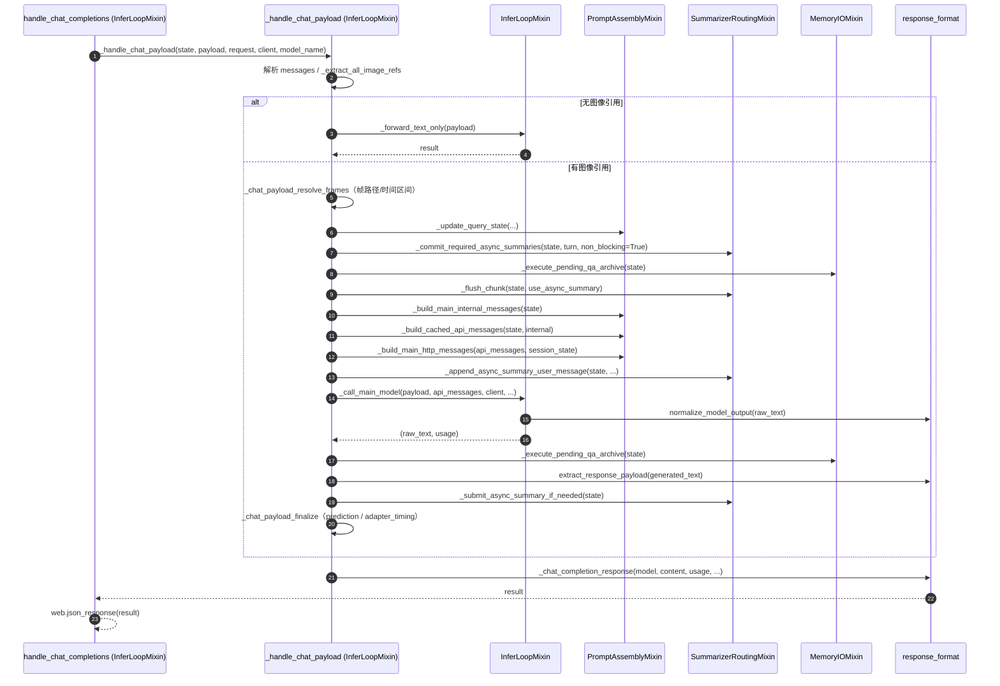

# ADR 0007 里程碑 2 设计 — `adapter_core.py` 职责簇拆分（增量、契约不变）

- **状态**：Approved（主理人齐活林 2026-07-21 批准；coordinator 落在 adapter_core.py，py-modules 缺口已在 96b5d56 修复故本 PR 不改 pyproject，adapter_core 内未使用重复常量顺手删除）
- **日期**：2026-07-20
- **作者**：高见远（Architect / software-architect）
- **上游基线**：`doc/adr/0007-split-live-adapter.md`（里程碑 1 已落地）、`doc/review-20260720-live-adapter-split.md`（评审报告）
- **关联附录**：`0007-milestone2-class-diagram.mermaid`、`0007-milestone2-sequence-diagram.mermaid`

## 0. 范围与原则

本次是**增量机械拆分**（纯搬迁 + 方法级内聚），目标是在**零行为变更、66 测试全绿、外部契约不变**的前提下，把 `adapter_core.py`（1992 行 / 66 个方法 / 5 职责簇）拆为 5 个职责 mixin 模块 + 一个 coordinator（薄门面）。

**明确排除**（留给独立 PR，本次不做）：
- #2 决策解析链路统一（`_parse_decision_tokens` 帧路径未走、缺 `decision`/`delegation_question`）；
- #3 常量收敛到单一 `prompt_constants.py`（系统提示/常量块 9 文件重复）；
- #4 并发竞态修复（`_memory_block_cache` warmup 未持锁）。

若拆分使某簇天然更易承接这些修复，在「§8 待明确事项」标注建议落点，但**不在此 PR 引入任何修复代码**。

---

## 1. 实现方案 + 框架选型

### 1.1 沿用技术栈

确认沿用现有纯 Python（requires-python 3.12）+ `aiohttp` 单体包结构，**不引入任何新第三方依赖、不引入新构建工具**。`StreamingInferAdapter` 仍是唯一对外类；门面 `live_adapter.py` 与 console script `joyvl-webinfer-adapter = "live_adapter:main"` 完全不动（见 §7.2 核验）。

### 1.2 Mixin 多继承 vs 组合（Composition）

| 维度 | Mixin 多继承 | 组合（Composition） |
|------|--------------|---------------------|
| 对外类身份 | `StreamingInferAdapter` 仍是同一类 ✅（满足测试 `__init__.__globals__` 与 `la._xxx` 契约） | 需在外层类转发/委托，破坏 `StreamingInferAdapter` 类身份 ❌ |
| `self.xxx` 调用 | 直接通过 MRO 解析，调用顺序/名称 0 改动 ✅ | 需改为 `self.session.xxx(...)`，触达 ~66 方法的所有调用点，回归面大 ❌ |
| 循环导入风险 | mixin 互不 import、仅 coordinator import 它们，无环 ✅ | 双向引用需 `@property` 懒绑定，更复杂 |
| 巨型方法搬迁 | `_handle_chat_payload` 整段搬入 `InferLoopMixin`，子步骤仍用 `self.*` ✅ | 需把内部 `self.*` 改为 `self.*` 委托，易错 |

**结论：采用 Mixin 多继承。** 这是唯一能在「不改调用点、保留类身份、保持门面契约」三约束下完成机械拆分的方案。

### 1.3 最终类结构（coordinator = `adapter_core.py` 自身）

> 选择把 `StreamingInferAdapter` 直接定义在 `adapter_core.py` 内扮演 coordinator 角色（而非新建 `coordinator.py`），原因是 `live_adapter.py:10` 已是 `from adapter_core import StreamingInferAdapter`、且 `app.py:12` 同样如此——**零门面改动**即可保持契约。若团队更想要独立 `coordinator.py`，仅需把 `live_adapter.py:10` / `app.py:12` 改为 `from coordinator import StreamingInferAdapter`（一行），见 §8。

```python
# adapter_core.py（coordinator / 薄门面）
from __future__ import annotations
import logging
from datetime import datetime
from pathlib import Path
from adapter_types import AdapterConfig, SessionState          # 契约必需：__init__.__globals__
from memory_store_client import MemoryStoreClient
from memory_summarizer import SummarizerModel
from openai import AsyncOpenAI
from session import SessionMixin
from infer_loop import InferLoopMixin
from summarizer_routing import SummarizerRoutingMixin
from memory_io import MemoryIOMixin
from prompt_assembly import PromptAssemblyMixin
# —— 编译期契约：re-export 被引用的私有符号（源模块不变）——
from prompt_building import (
    _compute_prompt_guard_max_chars, _estimate_messages_chars, _trim_messages_to_ctx,
)
from config import _env_bool, _env_int, _env_float, _split_paths
from response_format import _chat_completion_response, _openai_error_response, _short

LOGGER = logging.getLogger("streaming_infer_adapter")

class StreamingInferAdapter(                                          # MRO 顺序很重要
    SessionMixin,
    InferLoopMixin,
    SummarizerRoutingMixin,
    MemoryIOMixin,
    PromptAssemblyMixin,
):
    def __init__(self, config: AdapterConfig):
        ...  # 原 adapter_core.__init__ 整段搬入（逻辑 0 改动）

__all__ = [
    "StreamingInferAdapter",
    "_compute_prompt_guard_max_chars", "_estimate_messages_chars", "_trim_messages_to_ctx",
    "_env_bool", "_env_int", "_env_float", "_split_paths",
    "_chat_completion_response", "_openai_error_response", "_short",
]
```

MRO 解析顺序：`SessionMixin → InferLoopMixin → SummarizerRoutingMixin → MemoryIOMixin → PromptAssemblyMixin`（`StreamingInferAdapter` 自身最后）。只要 5 个 mixin 的方法名**全局唯一**（已核验，见 §9），MRO 不会产生歧义覆盖。

---

## 2. 文件清单（相对路径 + 预计行数 + 职责）

> 所有路径相对 `services/webinfer/`。新建 5 个 mixin 模块 + 改写 `adapter_core.py` 为 coordinator 薄门面（`live_adapter.py` / `app.py` / 其余模块均不改）。

| 文件 | 预计行数 | 角色 | 职责（方法簇） |
|------|---------|------|----------------|
| `session.py` | ~620 | `SessionMixin` | 会话生命周期（创建/销毁/过期清理/后台任务）、会话输出与调试输入持久化、meta 路由处理器 |
| `prompt_assembly.py` | ~360 | `PromptAssemblyMixin` | 角色提示装配（character profile 缓存/系统提示构建/记忆提示）、主消息体装配、generation kwargs |
| `memory_io.py` | ~180 | `MemoryIOMixin` | 记忆读写（memory-store warmup/recall/push）、qa_history 归档与文本路径 qa_history 写入 |
| `summarizer_routing.py` | ~360 | `SummarizerRoutingMixin` | 摘要路由（hot-swap 端点）、chunk flush、mid/long-term 摘要构建与压缩、异步摘要提交/提交屏障 |
| `infer_loop.py` | ~640 | `InferLoopMixin` | 主推理循环：`handle_text_chat` / `handle_chat_completions` / `_handle_chat_payload`（含子步骤内聚）/ `_handle_text_payload` / 帧解析 / 主模型调用 |
| `adapter_core.py` | ~120 | **coordinator / 薄门面** | 定义 `StreamingInferAdapter` 类 + `__init__` + 私有符号 re-export + `__all__`；**删除全部方法体** |

> 行数含模块 docstring、`from __future__ import annotations`、`LOGGER`、import 块；略高于原 1992 是因为每个模块自带 import/日志，属正常开销。

### 2.1 方法落点总表（66 方法 → 6 处）

> 标注 `[搬]` = 原样搬迁；`[拆]` = 从 `_handle_chat_payload` 内聚抽取的子步骤（行为不变）。

| # | 方法 | 落点模块 | 类型 |
|---|------|---------|------|
| 1 | `__init__` | adapter_core(coordinator) | 类定义 |
| 2 | `get_session` | session | 搬 |
| 3 | `_cleanup_expired_sessions` | session | 搬 |
| 4 | `_session_cleanup_loop` | session | 搬 |
| 5 | `start_background_tasks` | session | 搬 |
| 6 | `stop_background_tasks` | session | 搬 |
| 7 | `_init_session_dirs` | session | 搬 |
| 8 | `handle_models` | session | 搬 |
| 9 | `handle_health` | session | 搬 |
| 10 | `handle_reset` | session | 搬 |
| 11 | `handle_prompts_active` | session | 搬 |
| 12 | `handle_prompts_reload` | session | 搬 |
| 13 | `_session_output_path` | session | 搬 |
| 14 | `_session_debug_input_dir` | session | 搬 |
| 15 | `_session_sample_data` | session | 搬 |
| 16 | `_memory_trace` | session | 搬 |
| 17 | `_write_json_file` | session | 搬 |
| 18 | `_light_predictions` | session | 搬 |
| 19 | `_strip_base64_images` | session | 搬 |
| 20 | `_write_session_outputs_sync` | session | 搬 |
| 21 | `_write_session_outputs` | session | 搬 |
| 22 | `_on_write_task_done` | session | 搬 |
| 23 | `_flush_session_outputs` | session | 搬 |
| 24 | `_save_live_debug_input` | session | 搬 |
| 25 | `_maybe_save_chunk_start_model_input` | session | 搬 |
| 26 | `_save_summarizer_debug_input` | session | 搬 |
| 27 | `_load_character_profiles` | prompt_assembly | 搬 |
| 28 | `_system_prompt_cache_key` | prompt_assembly | 搬 |
| 29 | `_refresh_character_prompt_mtime` | prompt_assembly | 搬 |
| 30 | `_invalidate_system_prompt_cache` | prompt_assembly | 搬 |
| 31 | `reload_character_prompts` | prompt_assembly | 搬 |
| 32 | `active_character_prompt_paths` | prompt_assembly | 搬 |
| 33 | `_build_system_prompt` | prompt_assembly | 搬 |
| 34 | `_build_memory_prompt` | prompt_assembly | 搬 |
| 35 | `_build_internal_user_message` | prompt_assembly | 搬 |
| 36 | `_build_main_internal_messages` | prompt_assembly | 搬 |
| 37 | `_build_main_api_messages` | prompt_assembly | 搬 |
| 38 | `_build_cached_api_messages` | prompt_assembly | 搬 |
| 39 | `_build_main_http_messages` | prompt_assembly | 搬 |
| 40 | `_main_generation_kwargs` | prompt_assembly | 搬 |
| 41 | `_memory_warmup` | memory_io | 搬 |
| 42 | `_memory_recall` | memory_io | 搬 |
| 43 | `_memory_push` | memory_io | 搬 |
| 44 | `_update_text_qa_history` | memory_io | 搬 |
| 45 | `_execute_pending_qa_archive` | memory_io | 搬 |
| 46 | `handle_summarizer_route` | summarizer_routing | 搬 |
| 47 | `_flush_chunk` | summarizer_routing | 搬 |
| 48 | `_build_mid_term_summary_entry` | summarizer_routing | 搬 |
| 49 | `_compress_mid_terms` | summarizer_routing | 搬 |
| 50 | `_async_summary_enabled` | summarizer_routing | 搬 |
| 51 | `_async_first_summary_turns` | summarizer_routing | 搬 |
| 52 | `_append_async_summary_user_message` | summarizer_routing | 搬 |
| 53 | `_submit_async_summary_if_needed` | summarizer_routing | 搬 |
| 54 | `_commit_required_async_summaries` | summarizer_routing | 搬 |
| 55 | `_resolve_backend` | infer_loop | 搬 |
| 56 | `handle_text_chat` | infer_loop | 搬 |
| 57 | `_handle_text_payload` | infer_loop | 搬 |
| 58 | `handle_chat_completions` | infer_loop | 搬 |
| 59 | `_handle_chat_payload` | infer_loop | 搬（主体） |
| 59a | `_chat_payload_resolve_frames` | infer_loop | 拆（子步骤） |
| 59b | `_chat_payload_advance_chunk` | infer_loop | 拆（子步骤） |
| 59c | `_chat_payload_append_turn` | infer_loop | 拆（子步骤） |
| 59d | `_chat_payload_build_and_infer` | infer_loop | 拆（子步骤） |
| 59e | `_chat_payload_finalize` | infer_loop | 拆（子步骤） |
| 60 | `_forward_text_only` | infer_loop | 搬 |
| 61 | `_time_range_for_frame` | infer_loop | 搬 |
| 62 | `_resolve_frame_ref` | infer_loop | 搬 |
| 63 | `_save_base64_frame` | infer_loop | 搬 |
| 64 | `_validate_local_image_path` | infer_loop | 搬 |
| 65 | `_update_query_state` | infer_loop | 搬 |
| 66 | `_call_main_model` | infer_loop | 搬 |

> 说明：`_handle_chat_payload` 主体保留在 `InferLoopMixin`，并把 5 个清晰内聚的段落抽取为 `_chat_payload_*` 私有子步骤方法（§7.3 命名约定），**调用顺序与分支逻辑 0 改动**。这是本里程碑对巨型方法的唯一“内聚”动作，不含任何正确性修复。

### 2.2 模块级常量处置

`adapter_core.py` 顶部复制的常量块（`USER_QUERY_HEADER_*`、`VIDEO_HISTORY_HEADER_*`、`QA_*_LABEL_*`、`_CHARS_PER_TOKEN_BUDGET`、`_CTX_SAFETY_FACTOR`、`_PROMPT_GUARD_MIN_RECENT`、`DEFAULT_SAVE_ROOT`、`TIME_RANGE_RE/VALUE_RE`、`DEFAULT_SYSTEM_PROMPT_EN/DEFAULT_SYSTEM_PROMPT`）**在 `adapter_core.py` 的方法体内从未被引用**（仅定义 + 一处 docstring 提及），其规范副本已存在于 `adapter_types` / `config` / `prompt_building` / `time_ranges` 等里程碑 1 模块中。

**决策：新模块与薄门面均不携带这些重复常量**（即顺手消除一份 #3 重复，但不在本次收敛其余 8 份）。无外部代码 `from adapter_core import <这些常量>`（已 grep 确认），故不构成契约破坏。风险与回滚见 §9 / §8。

---

## 3. 数据结构与接口（类图，Mermaid classDiagram）

> 完整图见 `0007-milestone2-class-diagram.mermaid`。下图展示 `StreamingInferAdapter` 与各 mixin 的继承关系及关键方法签名；跨模块调用通过 `self.*`（MRO）解析，方法体内部 `import` 的辅助函数（`prompt_building` / `response_format` / `time_ranges` / `request_parsing` / `system_prompts` / `io_utils` / `memory_store_client` / `memory_summarizer`）不在类图中展开。

```mermaid
classDiagram
    class SessionMixin {
        +get_session(session_id: str) SessionState
        +_cleanup_expired_sessions() list~SessionState~
        +_session_cleanup_loop()
        +start_background_tasks()
        +stop_background_tasks()
        +_init_session_dirs(state: SessionState)
        +handle_models(request) web.Response
        +handle_health(request) web.Response
        +handle_reset(request) web.Response
        +handle_prompts_active(request) web.Response
        +handle_prompts_reload(request) web.Response
        +_session_output_path(state, light: bool) Path
        +_flush_session_outputs(state: SessionState)
        +_write_session_outputs(state: SessionState)
        +_save_live_debug_input(state, record, stem) str
    }
    class PromptAssemblyMixin {
        +_build_system_prompt(language: str) str
        +_build_memory_prompt(state: SessionState) str
        +_build_internal_user_message(...) dict
        +_build_main_internal_messages(state) tuple
        +_build_cached_api_messages(state, internal) list
        +_build_main_http_messages(api_messages, session_state) list
        +_main_generation_kwargs(payload) dict
        +reload_character_prompts() list
    }
    class MemoryIOMixin {
        +_memory_warmup(state)
        +_memory_recall(state, question) list
        +_memory_push(state) int
        +_update_text_qa_history(state, api_messages, clean_text, decision)
        +_execute_pending_qa_archive(state)
    }
    class SummarizerRoutingMixin {
        +handle_summarizer_route(request) web.Response
        +_flush_chunk(state, use_async_summary)
        +_build_mid_term_summary_entry(state, chunk, ...) tuple
        +_compress_mid_terms(state)
        +_async_summary_enabled() bool
        +_submit_async_summary_if_needed(state)
        +_commit_required_async_summaries(state, ...) 
    }
    class InferLoopMixin {
        +_resolve_backend(model_name) tuple
        +handle_text_chat(request) web.Response
        +_handle_text_payload(state, payload, ...) dict
        +handle_chat_completions(request) web.Response
        +_handle_chat_payload(state, payload, request, ...) dict
        +_forward_text_only(payload, ...) dict
        +_call_main_model(inbound_payload, api_messages, ...) tuple
        +_update_query_state(state, prompt_text, time_range) str
    }
    class StreamingInferAdapter {
        +__init__(config: AdapterConfig)
    }
    StreamingInferAdapter --|> SessionMixin
    StreamingInferAdapter --|> InferLoopMixin
    StreamingInferAdapter --|> SummarizerRoutingMixin
    StreamingInferAdapter --|> MemoryIOMixin
    StreamingInferAdapter --|> PromptAssemblyMixin
    note for StreamingInferAdapter "定义在 adapter_core.py(coordinator)。MRO: Session→InferLoop→Summarizer→MemoryIO→PromptAssembly。__init__ 所在模块须 import AdapterConfig, SessionState 以满足测试 __globals__ 断言。"
```



---

## 4. 程序调用流程（时序图，Mermaid sequenceDiagram）

> 完整图见 `0007-milestone2-sequence-diagram.mermaid`。展示一次 `/v1/chat/completions` 请求如何跨 mixin 流转（保持现有调用顺序）。



---

## 5. 任务列表（有序、含依赖、按实现顺序）

> 本次为增量拆分，T1–T5 各新建一个 mixin 模块（彼此**独立、可并行**），T6 改写 coordinator 薄门面（依赖 T1–T5），T7 回归与契约验证（依赖 T6）。下文“触达门面契约”指是否改动 `live_adapter.py` 的 import / `__all__`——本方案**仅 T6 维持契约、不改写门面文件本身**。

### T1 — 新建 `session.py`（SessionMixin，搬 25 方法）
- **源文件**：新建 `services/webinfer/session.py`
- **落点方法**：#2–#26（`get_session` … `_save_summarizer_debug_input`，共 25 个）
- **依赖**：无（可并行）
- **优先级**：P0
- **触达门面契约**：否
- **要点**：模块顶部 `from __future__ import annotations` + `LOGGER = logging.getLogger("streaming_infer_adapter")`；import `adapter_types`(AdapterConfig,SessionState)、`aiohttp.web`、`io_utils`(`sanitize_output_name`)、`response_format`(`archive_chunk_response_records`)、`config`；**不 import `adapter_core`/`live_adapter`**。

### T2 — 新建 `prompt_assembly.py`（PromptAssemblyMixin，搬 14 方法）
- **源文件**：新建 `services/webinfer/prompt_assembly.py`
- **落点方法**：#27–#40（`_load_character_profiles` … `_main_generation_kwargs`，共 14 个）
- **依赖**：无（可并行）
- **优先级**：P0
- **触达门面契约**：否
- **要点**：import `adapter_types`、`prompt_building`(`_build_system_prompt`,`_compute_prompt_guard_max_chars`,`_estimate_messages_chars`,`_get_i18n`,`_trim_messages_to_ctx`,`build_dynamic_system_content`,`build_static_system_content`)、`system_prompts`(`compose_system_prompt_with_memory`,`load_character_prompts`,`resolve_prompt_paths`)、`io_utils`(`_internal_message_to_openai`)。

### T3 — 新建 `memory_io.py`（MemoryIOMixin，搬 5 方法）
- **源文件**：新建 `services/webinfer/memory_io.py`
- **落点方法**：#41–#45（`_memory_warmup` … `_execute_pending_qa_archive`，共 5 个）
- **依赖**：无（可并行）
- **优先级**：P0
- **触达门面契约**：否
- **要点**：import `adapter_types`、`response_format`(`archive_chunk_response_records`)、`time_ranges`(`_parse_start_second`)、`config`(`reset_chunk_state` 若 `_execute_pending_qa_archive` 需要——实际不需要，按实际引用裁剪)。

### T4 — 新建 `summarizer_routing.py`（SummarizerRoutingMixin，搬 9 方法）
- **源文件**：新建 `services/webinfer/summarizer_routing.py`
- **落点方法**：#46–#54（`handle_summarizer_route` … `_commit_required_async_summaries`，共 9 个）
- **依赖**：无（可并行）
- **优先级**：P0
- **触达门面契约**：否
- **要点**：import `adapter_types`、`aiohttp.web`、`response_format`(`_openai_error_response`)、`time_ranges`(`_compute_chunk_frame_range`,`_get_response_frame_indices`)、`io_utils`(`_file_to_data_url_cached`)、`config`(`reset_chunk_state`)、本模块内调用 `session._save_summarizer_debug_input` 经 `self.*` 解析。

### T5 — 新建 `infer_loop.py`（InferLoopMixin，搬 12 方法 + 子步骤内聚）
- **源文件**：新建 `services/webinfer/infer_loop.py`
- **落点方法**：#55–#66（`_resolve_backend` … `_call_main_model`，共 12 个）；并把 #59 `_handle_chat_payload` 内聚为 `_chat_payload_resolve_frames / _advance_chunk / _append_turn / _build_and_infer / _finalize`（5 个 `[拆]` 子步骤，行为不变）
- **依赖**：无（可并行，但建议最后做，因其耦合面最大）
- **优先级**：P0
- **触达门面契约**：否
- **要点**：import `adapter_types`、`aiohttp.web`、`request_parsing`(`_extract_all_image_refs`,`_extract_time_ranges_from_request`,`_extract_time_range_from_request`,`_extract_time_range_from_text`,`_extract_user_prompt_text`,`_read_json`,`_request_session_id`,`_safe_session_id`)、`time_ranges`(`_format_turn_time_range`,`_strip_time_range_from_text`)、`response_format`(`_chat_completion_response`,`_openai_error_response`,`_parse_decision_tokens`,`_short`,`extract_response_payload`,`normalize_model_output`,`build_model_input_record`)、`io_utils`(`_extract_extra_body`)、`config`(`reset_chunk_state`)、`prompt_building`(`_compute_prompt_guard_max_chars`,`_estimate_messages_chars`,`_trim_messages_to_ctx`)。巨型方法仅做方法级内聚，**不改任何分支/变量/调用顺序**。

### T6 — 改写 `adapter_core.py` 为 coordinator 薄门面（维持契约）
- **源文件**：改写 `services/webinfer/adapter_core.py`（删除全部方法体，仅留类定义 + `__init__` + re-export + `__all__`）；`live_adapter.py` / `app.py` **不改**
- **落点方法**：#1 `__init__`（整段搬入 coordinator）；其余 65 方法已从 T1–T5 移除
- **依赖**：T1, T2, T3, T4, T5（必须全部完成）
- **优先级**：P0
- **触达门面契约**：**是（维持）**——`StreamingInferAdapter` 仍由 `adapter_core` 导出；`__init__` 所在模块须 `from adapter_types import AdapterConfig, SessionState`；re-export 私有符号（§7.2）。`live_adapter.py` 的 `from adapter_core import StreamingInferAdapter` 与 `__all__` 继续有效。

### T7 — 全量回归 + 契约验证
- **源文件**：无新建；运行 `pytest` 与契约检查脚本
- **依赖**：T6
- **优先级**：P0
- **触达门面契约**：验证项
- **验证清单**：
  1. `cd services/webinfer && python -m pytest tests/ -q` → **66 passed**；
  2. `python -c "import live_adapter; from live_adapter import StreamingInferAdapter, AdapterConfig"` 成功；
  3. `python -c "import live_adapter as la; assert la._compute_prompt_guard_max_chars and la._estimate_messages_chars and la._trim_messages_to_ctx"` 三项私有符号可达；
  4. `python -c "from live_adapter import StreamingInferAdapter as S; assert S.__init__.__globals__['AdapterConfig'] and S.__init__.__globals__['SessionState']"` 通过（核心契约）；
  5. `ruff check services/webinfer` → 无 `F401/F811/F821/E402/I001/D100`（新模块各自达标）。

---

## 6. 依赖包列表

**本次不引入任何新第三方依赖。** 仅内部模块重组：
- 运行时依赖（已存在，沿用）：`aiohttp`、`openai`（milestone 1 已列于 `pyproject.toml`）。
- 标准库：`asyncio`、`copy`、`json`、`logging`、`os`、`re`、`time`、`datetime`、`pathlib`、`typing`。
- **无需修改 `pyproject.toml` 的 `py-modules`**（若里程碑 1 的打包缺口已修）。若尚未修，本 PR 应一并补齐 13 个顶层模块（属评审报告最小可合并集，独立于本拆分）。

---

## 7. 共享知识（跨文件约定）

### 7.1 import 纪律（硬性）
- 每个新模块首行 `from __future__ import annotations`（隔离注解期 import，避免 `web.Request` / `AsyncOpenAI` / `SessionState` 触发运行时依赖）。
- **子模块（session/infer_loop/summarizer_routing/memory_io/prompt_assembly）不得反向 import `adapter_core` 或 `live_adapter`**；跨簇调用一律走 `self.*`（MRO）。
- `config` 不 import `adapter_types`（延续 milestone 1 约束，维持无环）。
- 每个 mixin 模块自带 `LOGGER = logging.getLogger("streaming_infer_adapter")`，不依赖 coordinator 的 LOGGER。
- 仅 `adapter_core.py`(coordinator) import 全部 5 个 mixin + `AdapterConfig`/`SessionState` + 私有符号源。

### 7.2 私有符号 re-export 清单（维持编译期契约）
取自 `live_adapter.py` 的 `__all__` 中被测试引用的私有助手。它们**不在任何新 mixin 中定义**，仍住在 milestone 1 模块；`adapter_core.py` 薄门面重新导出它们以保 `from adapter_core import <x>` 仍可编译：

| 私有符号 | 规范源模块 | 被谁引用 |
|----------|-----------|----------|
| `_compute_prompt_guard_max_chars` | `prompt_building` | `test_prompt_guard.py` via `la._*` |
| `_estimate_messages_chars` | `prompt_building` | 同上 |
| `_trim_messages_to_ctx` | `prompt_building` | 同上 |
| `_env_bool` / `_env_int` / `_env_float` / `_split_paths` | `config` | `live_adapter.__all__` |
| `_chat_completion_response` / `_openai_error_response` / `_short` | `response_format` | `live_adapter.__all__` |

> `live_adapter.py` 自身 import 不变（它直接从 `prompt_building`/`config`/`response_format` 取这些符号），所以 `la._xxx` 链路本来就与 `adapter_core` 无关——本拆分后依然成立。

### 7.3 `_handle_chat_payload` 子步骤方法命名约定
为治理 ~324 行巨型方法，抽取 5 个私有子步骤（仅内聚、不改行为），统一前缀 `_chat_payload_`：
- `_chat_payload_resolve_frames`：图像引用→帧路径、时间区间解析与格式化（原 ~1112–1146 行）；
- `_chat_payload_advance_chunk`：chunk 边界判定、qa 归档、flush、carry-over（原 ~1150–1204 行）；
- `_chat_payload_append_turn`：帧计数、消息追加、`async_summary` 段追加（原 ~1206–1228 行）；
- `_chat_payload_build_and_infer`：prompt 装配 + 主模型调用（原 ~1266–1314 行，含 forced-silence 分支）；
- `_chat_payload_finalize`：response 解析、prediction/timing 组装、结果封包（原 ~1322–1418 行）。

调用顺序严格保持：`resolve_frames → advance_chunk → append_turn → build_and_infer → finalize`，与原 `if/for` 控制流一致。

---

## 8. 待明确事项

1. **coordinator 是否独立成 `coordinator.py`？** 本设计选 `adapter_core.py` 内做 coordinator（零门面改动）。若团队偏好独立文件，需同步改 `live_adapter.py:10` 与 `app.py:12` 的 import 源（一行/处），并确认 `pyproject.toml` 的 `py-modules` 一并登记 `coordinator`。
2. **重复常量是否顺手收敛？** 本设计在 `adapter_core` 拆分中**删除**了其内部那份未使用的重复常量（§2.2），但其余 8 个模块的同款重复（#3）保持不动，留独立 PR。需团队确认“删一份不引发外部引用断裂”的假设（已 grep 无 `from adapter_core import <常量>`）。
3. **`_update_query_state` / `_update_text_qa_history` 归属**：本设计将前者放 `infer_loop`（chat payload 流程内聚），后者放 `memory_io`（qa_history 写入）。若团队认为二者应同簇，可在 `memory_io` 合并（仅影响落点，不改行为）。
4. **pyproject `py-modules` 打包缺口**：里程碑 1 评审报告的 🔴 阻断项（10 模块未打包）是否已在本次基线前修复？若未修，本 PR 应一并补齐 13 个顶层模块，否则 `pip install .` 后 `live_adapter` import 会 `ModuleNotFoundError`（与拆分无关但会阻断验收）。
5. **`_handle_chat_payload` 子步骤粒度**：§7.3 给的是 5 段抽取；工程师可按可读性与 diff 审查便利性微调段边界，只要行为等价即可。
6. **#2/#3/#4 落点建议**（本次不做，仅标注）：决策解析统一可落在 `infer_loop` + `response_format`；常量收敛建议新建 `prompt_constants.py` 由 `prompt_assembly` 引用；并发竞态修复集中在 `memory_io._memory_warmup` 与 `session.get_session` 的锁临界区。

---

## 9. 风险评估

| 风险点 | 等级 | 描述 | 缓解 |
|--------|------|------|------|
| 循环导入 | 中 | mixin 若误 import `adapter_core`/`live_adapter` 会成环 | 硬性 import 纪律（§7.1）；仅 coordinator import mixin；静态 `ruff`/导入自测；新模块均 `from __future__ import annotations` |
| 巨型方法搬迁 | 中 | `_handle_chat_payload` 整段搬迁 + 子步骤抽取易漏变量/缩进 | 先整段 `[搬]` 保证通过，再增量 `[拆]` 子步骤并逐段 `pytest`；不改分支与调用顺序 |
| 测试契约（`__init__.__globals__`） | 高 | 测试读 `StreamingInferAdapter.__init__.__globals__["AdapterConfig"|"SessionState"]` | coordinator 模块显式 `from adapter_types import AdapterConfig, SessionState`；T7 第 4 项专门验证 |
| `StreamingInferAdapter` 类身份 | 高 | 若改为 composition 或挪到新文件会破坏 `from adapter_core import` 与 `la._xxx` | 类定义在 `adapter_core.py`（coordinator），MRO 多继承；`live_adapter.py`/`app.py` 零改动 |
| MRO 方法名冲突 | 低 | 两 mixin 同名方法会被 MRO 静默覆盖 | 已核验 66 方法名全局唯一；T7 `ruff` + 全量测试覆盖 |
| 私有符号可达性 | 低 | `la._compute_prompt_guard_max_chars` 等需仍可达 | 这些符号本就来自 `prompt_building` 等，门面 import 不变；coordinator 额外 re-export 保 `from adapter_core import` |
| 意外删改行为 | 中 | “纯搬迁”中误改一行逻辑 | 拆分后 `git diff` 应仅含文件边界变化；T7 跑 66 测试 + 可选 e2e `test_jarvis_webinfer_e2e.py` 比对 |

**总体结论**：采用 Mixin 多继承 + coordinator 薄门面，是唯一能在「不改调用点、保留类身份、维持门面契约、零行为变更」约束下完成机械拆分的方案；主要风险集中在巨型方法搬迁与测试契约两处，均有明确验证项覆盖，整体可控。
