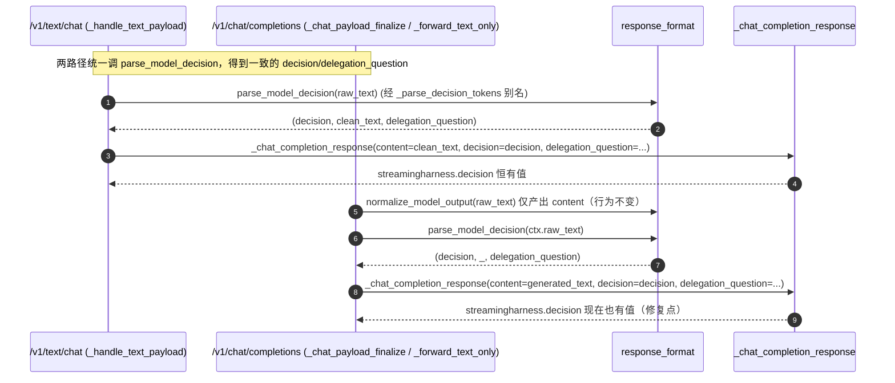
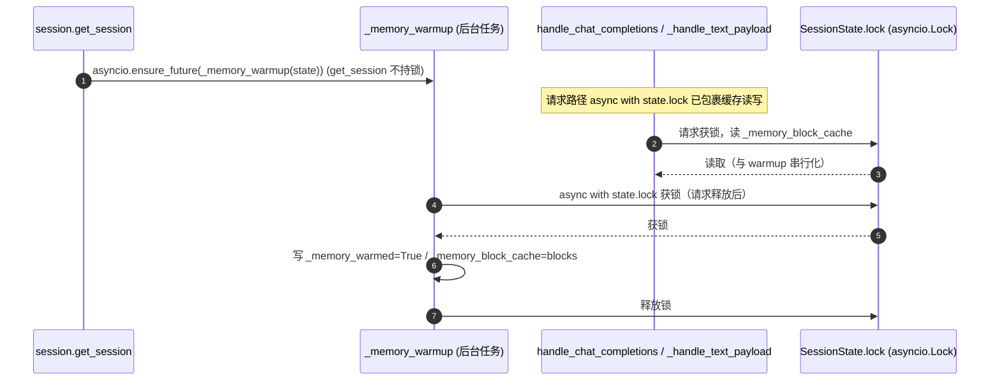

# ADR 0008 里程碑 2 后 P0 修复设计 — 决策解析统一 / 常量收敛 / 并发竞态

- **状态**：Draft（架构师高见远 2026-07-21 提交，待主理人齐活林批准并入工程师实现队列）
- **日期**：2026-07-21
- **作者**：高见远（Architect / software-architect）
- **上游基线**：`doc/prd-2026-07-21-p0-adapter-fixes.md`（许清楚）、`doc/adr/0007-milestone2-design.md`、实际代码 `services/webinfer/*.py`
- **关联附录**：`0008-p0-adapter-fixes-sequence-diagram.mermaid`、`0008-p0-adapter-fixes-class-diagram.mermaid`

## 0. 范围与原则

本设计是**纯重构 / 正确性修复**，落在独立的第二个 PR（不与 milestone2 PR #1 交叉）。三项修复各自独立、可单独测试、可单独回滚。严格遵守：

- **零行为变更**：输出语义等价，66 测试全绿。
- **外部契约不变**：`StreamingInferAdapter` 类身份、`la._xxx` 私有符号可达性、`__init__.__globals__["AdapterConfig"|"SessionState"]` 必须保持。
- **无新依赖、无新框架**：沿用纯 Python 3.12 + `aiohttp`/`openai`。
- **不动 milestone2 已落地结构**：5 个 mixin + coordinator 薄门面保持不动。
- **不动 py-modules 既有内容的前提**：见 §2/§8 — 新增模块必须登记，且当前 checkout 的 `pyproject.toml` 与 PRD「已修复」表述存在出入，需主理人确认。

> 代码实地核实结论：PRD §7 调研佐证**全部属实**（行号与当前代码一致）。本设计的拍板见 §3 / §8。

---

## 1. 实现方案 + 框架选型

### 1.1 框架 / 依赖

无新框架、无新第三方依赖。纯 Python 内部模块重组 + 函数级统一 + 加锁。运行时依赖沿用 `aiohttp`、`openai`、`Pillow`、`httpx`（已在 `pyproject.toml`）。

### 1.2 三项修复的技术路线

| 项 | 路线 | 关键落点 | 改动面 |
|----|------|---------|--------|
| **#2 决策解析统一** | 在 `response_format.py` 新增**单一**解析入口 `parse_model_decision(raw_text)`，文本/视频两路径均调用它得到 `(decision, clean_text, delegation_question)`；保留 `normalize_model_output` 仅作「content 归一化」用（视频路径 content 不变）。`text` 路径经 `_parse_decision_tokens`（置为 `parse_model_decision` 别名，零成本兼容）`video` 路径在 `_chat_payload_finalize` 与 `_forward_text_only` 调 `parse_model_decision` 并显式回传 `decision`/`delegation_question`。 | `response_format.py`、`infer_loop.py` | 2 文件 |
| **#3 常量收敛** | 新建叶子模块 `prompt_constants.py`，集中 8 模块逐字相同的 **14 个常量**；8 个模块删除本地副本，改为 `from prompt_constants import <实际使用的名字>`。 | 新增 `prompt_constants.py` + 改 8 模块 + `pyproject.toml` 登记 | 9–10 文件 |
| **#4 并发竞态** | 复用既有 `state.lock`（`asyncio.Lock`，`adapter_types.py:159`）。仅给 warmup 路径（`_memory_warmup`/`_memory_recall`）补锁；请求路径（`:117/151-152`、`:219/461-462`、`prompt_assembly.py:135`）**已在锁内，不改**。 | `memory_io.py` | 1 文件 |

### 1.3 为什么这样选（拍板依据）

- **#2 不新建模块、落在 `response_format.py`**：与 PRD 建议一致；`response_format.py` 本就是输出归一化/格式化的归宿，且 `extract_response_payload` 已在此。
- **#3 收敛“全部 14 个”而非仅 4 个**：PRD §3 把 `DEFAULT_SYSTEM_PROMPT(_EN)`/`DEFAULT_SAVE_ROOT`/`TIME_RANGE_RE` 列为 must-have，§6 把 `USER_QUERY_HEADER_*` 等列为「是否扩大」的待确认项。实地核对 8 模块对这 14 个常量**逐字完全相同**，且其中 10 个（prompt-text 族 + 预算系数）在 7 个模块里纯属死副本、唯一真实消费者是 `prompt_building.py`。只收敛 4 个会留下 7×10 份仍会漂移的副本，违背 #3「消除重复防漂移」的根本目的。故**拍板：一次性收敛全部 14 个**（语义零变更、风险低、彻底）。
- **#4 用 `state.lock` 而非新增 `_memory_lock`**：请求路径的全部缓存读写**已经**在 `state.lock` 内；只需把未加锁的 warmup 路径纳入同一把锁即可满足「所有读写在同一把锁内」。新增独立锁反而要同时改造 3 处请求路径读点（infer_loop/prompt_assembly），改动更大且引入 `_memory_lock` 与 `state.lock` 两套锁保护同一数据反而更复杂。`_memory_recall` 当前**不在请求锁内被调用**（grep 确认其为未接入请求流的死代码，仅自测调用），故 `_memory_warmup` 内部 `async with state.lock` 不会与任何「已持锁」调用者重入 → 无死锁。约束写在 §7。

---

## 2. 文件列表及相对路径

> 所有路径相对 `services/webinfer/`。

| 文件 | 角色 | 本 PR 动作 | 关联修复 |
|------|------|-----------|---------|
| `prompt_constants.py` | **新增** | 集中定义 14 个共享常量（纯 `import re`，无内部 import，叶子模块） | #3 |
| `response_format.py` | 修改 | #2：新增 `parse_model_decision`，`_parse_decision_tokens = parse_model_decision`（别名）；#3：删除顶部常量块（本地未使用，不 import） | #2,#3 |
| `infer_loop.py` | 修改 | #2：在 `_chat_payload_finalize`（视频路径）与 `_forward_text_only` 调 `parse_model_decision(ctx.raw_text)` 并把 `decision`/`delegation_question` 传给 `_chat_completion_response`；import 增加 `parse_model_decision` | #2 |
| `memory_io.py` | 修改 | #4：`_memory_warmup`/`_memory_recall` 的 `_memory_block_cache`/`_memory_warmed` 读写包入 `async with state.lock` | #4 |
| `config.py` | 修改 | #3：删常量块；`from prompt_constants import DEFAULT_SAVE_ROOT`（`:328/419` 使用） | #3 |
| `app.py` | 修改 | #3：删常量块；`from prompt_constants import DEFAULT_SAVE_ROOT, DEFAULT_SYSTEM_PROMPT_EN`（`:328/419/385` 使用） | #3 |
| `adapter_types.py` | 修改 | #3：删常量块；`from prompt_constants import DEFAULT_SYSTEM_PROMPT_EN`（`:149` 使用） | #3 |
| `prompt_building.py` | 修改 | #3：删常量块；`from prompt_constants import (USER_QUERY_HEADER_*, VIDEO_HISTORY_HEADER_*, QA_HISTORY_HEADER_*, QA_QUERY_LABEL_*, QA_RESPONSE_LABEL_*, _CHARS_PER_TOKEN_BUDGET, _CTX_SAFETY_FACTOR, _PROMPT_GUARD_MIN_RECENT)`（`_get_i18n`/`_compute_prompt_guard_max_chars`/`_trim_messages_to_ctx` 使用） | #3 |
| `io_utils.py` | 修改 | #3：删常量块；`from prompt_constants import DEFAULT_SAVE_ROOT`（`:98` 使用） | #3 |
| `request_parsing.py` | 修改 | #3：删常量块（本地函数均未引用这些常量，故**不 import**） | #3 |
| `time_ranges.py` | 修改 | #3：删常量块；`from prompt_constants import TIME_RANGE_RE, TIME_RANGE_VALUE_RE, TIME_VALUE_RE`（`:94/105/109/113/157/161/225` 使用） | #3 |
| `pyproject.toml` | 修改 | #3：在 `[tool.setuptools] py-modules` 追加 `"prompt_constants"`（**必做**，否则 `pip install` 漏打包；见 §8 分歧提示） | #3 |
| `adapter_core.py` | **不改** | 维持 coordinator 薄门面；`__init__.__globals__` 契约不受影响（`prompt_constants` 不进 `__all__`） | — |
| `session.py` / `prompt_assembly.py` / `summarizer_routing.py` | **不改** | 这些模块本就不定义那 14 个常量，无需改造 | — |

---

## 3. 数据结构与接口

### 3.1 #2 统一解析入口（`response_format.py`）

```python
def parse_model_decision(raw_text: str) -> tuple[str, str, Optional[str]]:
    """单一决策解析入口（#2 统一点）。

    返回 (decision, clean_text, delegation_question)：
      - decision ∈ {"silence", "response", "delegation"}，永不为 None；
      - clean_text：去 token 后的正文（silence/delegation 时为 ""）；
      - delegation_question：decision=="delegation" 时为被委派问题，否则 None。

    识别 </response> / </silence> / </delegation> 三种 token，取**最早**出现者；
    无 token 的裸回复按 response 处理（与 normalize_model_output 行为对齐）。
    """
    text = (raw_text or "").strip()
    if not text:
        return "silence", "", None
    earliest: Optional[tuple[int, str]] = None
    for marker in ("</response>", "</silence>", "</delegation>"):
        idx = text.find(marker)
        if idx >= 0 and (earliest is None or idx < earliest[0]):
            earliest = (idx, marker)
    if earliest is None:
        return "response", text, None
    _, marker = earliest
    tail = text[earliest[0] + len(marker):].strip()
    if marker == "</silence>":
        return "silence", "", None
    if marker == "</delegation>":
        return "delegation", "", tail or None
    return "response", tail, None


# 兼容别名：保持既有 import 不变（infer_loop.py 文本路径无需改动）
_parse_decision_tokens = parse_model_decision
```

> 保留 `normalize_model_output(text) -> str` 作为「content 归一化」助手（仅用于视频路径 `generated_text` 与 `extract_response_payload`），**行为不变**。两套实现不再分叉：`parse_model_decision` 是 decision/delegation 的唯一权威；`normalize_model_output` 仅产出 content 字符串。

### 3.2 #3 `prompt_constants.py` 导出（新增，叶子模块）

```python
# prompt_constants.py —— 纯常量，只 import re，无任何内部模块 import（杜绝循环依赖）
from __future__ import annotations
import re

USER_QUERY_HEADER_EN = "[User Query (IMPORTANT — follow this instruction)]"
USER_QUERY_HEADER_ZH = "[用户问题（重要——请遵循此指令）]"
VIDEO_HISTORY_HEADER_EN = ("[Video History]\n" "...")
VIDEO_HISTORY_HEADER_ZH = ("[Video History]\n" "...")
QA_HISTORY_HEADER_EN = ("[Q&A History]\n" "The following are previous queries and the system's responses.\n\n")
QA_HISTORY_HEADER_ZH = ("[Q&A History]\n" "以下是之前的用户提问及系统的回复。\n\n")
QA_QUERY_LABEL_EN = "Query"
QA_QUERY_LABEL_ZH = "提问"
QA_RESPONSE_LABEL_EN = "Response"
QA_RESPONSE_LABEL_ZH = "回复"
_CHARS_PER_TOKEN_BUDGET: float = 3.0
_CTX_SAFETY_FACTOR: float = 0.85
_PROMPT_GUARD_MIN_RECENT: int = 2
DEFAULT_SAVE_ROOT = "result"
TIME_RANGE_RE = re.compile(r"<(?P<range>...)>)")
TIME_RANGE_VALUE_RE = re.compile(r"^(?P<range>...)$")
TIME_VALUE_RE = re.compile(r"^(?P<value>\d+(?:\.\d+)?)(?:\s*(?:seconds?|s))$")
DEFAULT_SYSTEM_PROMPT_EN = """You are a real-time video streaming assistant ..."""
DEFAULT_SYSTEM_PROMPT = """You are a real-time video streaming assistant ..."""
```

各模块**只 import 自己实际使用的名字**（见 §2 表格）。`request_parsing.py` 与 `response_format.py` 本地函数均未引用这些常量 → 删块后**不 import**。

### 3.3 #4 锁方案（`memory_io.py`，复用 `state.lock`）

```python
async def _memory_warmup(self, state):
    # 与请求路径共用同一把 state.lock，消除 warmup 写缓存的竞态。
    # 不得在已持有 state.lock 时调用（asyncio.Lock 非重入）。
    if state._memory_warmed:
        return
    async with state.lock:                     # ← 补锁（原 :36-45 无锁）
        if state._memory_warmed:               # 双检：防并发重复 warmup
            return
        state._memory_warmed = True            # 先占标志，IO 期间其他读者看到 warmed=True
    try:
        blocks = await self.memory_store.warmup(state.session_id)
    except Exception as exc:
        LOGGER.warning("memory warmup failed for %s: %s", state.session_id, exc)
        return
    if blocks:
        async with state.lock:                 # ← 缓存写也在锁内
            state._memory_block_cache = blocks
            LOGGER.info("memory warmup %s: pulled %d block(s)", state.session_id, len(blocks))


async def _memory_recall(self, state, question):
    if not question:
        async with state.lock:                 # ← 读在锁内
            return list(state._memory_block_cache)
    if not state._memory_warmed:               # bool 读安全（事件循环单线程，await 前原子）
        await self._memory_warmup(state)       # 其内部自取锁，recall 此刻不持锁 → 无重入
    async with state.lock:
        return list(state._memory_block_cache)
```

> 请求路径读写（`infer_loop.py:117/151-152` 写入、`:219/461-462` 读取；`prompt_assembly.py:135` 读取）**已在 `state.lock` 内，本 PR 不改**。至此 `_memory_block_cache`/`_memory_warmed` 的**全部**读写均落在 `state.lock` 临界区，fail-soft 与「仅首次生效」语义保留（`_memory_warmed` 双检 + guard）。

---

## 4. 程序调用流程（Mermaid 时序图）

> 完整图见 `0008-p0-adapter-fixes-sequence-diagram.mermaid`。

### 4.1 #2 统一后：文本路径 vs 视频路径



### 4.2 #4 加锁后：warmup 后台写 vs 请求读



---

## 5. 任务列表 T1–Tn（有序、含依赖、独立可测）

> T1/T2/T3 三项**互不依赖**，可并行开发、各自独立回滚；T4 依赖前三项。注意 T1 与 T2 都改 `response_format.py`（T1 动函数区、T2 动顶部常量区，互不重叠），建议**顺序提交**各自独立 commit 以便单独回滚。

### T1 — #2 决策解析入口统一
- **源文件**：`response_format.py`（新增 `parse_model_decision`；`_parse_decision_tokens = parse_model_decision` 别名）、`infer_loop.py`（import 增加 `parse_model_decision`；`_chat_payload_finalize` 与 `_forward_text_only` 调 `parse_model_decision(ctx.raw_text or "")` 并透传 `decision`/`delegation_question` 给 `_chat_completion_response`）
- **依赖**：无
- **优先级**：P0
- **触达外部契约**：否（`_parse_decision_tokens` 仍可达，文本路径行为不变）
- **验证点**：
  1. `tests/test_text_chat_endpoint.py` `:207/:232/:252` 既有断言继续通过（文本路径 decision/silence/delegation 不变）；
  2. 视频路径（`/v1/chat/completions`）响应新增 `streamingharness.decision`（值 ∈ silence/response/delegation）与 `delegation_question`；`_forward_text_only` 同款；
  3. `ruff check services/webinfer` 无 `F401/F811/F821`；
  4. （建议，对应 PRD P1-b）补一条视频路径 decision 单测。

### T2 — #3 常量收敛 `prompt_constants`
- **源文件**：**新增** `prompt_constants.py`；改 `config.py`/`app.py`/`adapter_types.py`/`prompt_building.py`/`io_utils.py`/`request_parsing.py`/`time_ranges.py`/`response_format.py`（删常量块、按需 import）；改 `pyproject.toml`（`py-modules` 追加 `"prompt_constants"`）
- **依赖**：无
- **优先级**：P0
- **触达外部契约**：否（常量从未进 `__all__`，grep 确认无外部 `from <module> import <CONST>` 与无限定引用）
- **验证点**：
  1. `grep -rn "DEFAULT_SYSTEM_PROMPT\|TIME_RANGE_RE\|USER_QUERY_HEADER\|_CHARS_PER_TOKEN_BUDGET\|_PROMPT_GUARD_MIN_RECENT"` 在 8 模块内**零命中**（常量定义已移除）；
  2. 启动导入冒烟：`python -c "import prompt_constants, config, app, adapter_types, prompt_building, io_utils, request_parsing, time_ranges, response_format"` 全成功（无循环导入）；
  3. `pytest services/webinfer/tests -q` 66 passed；
  4. `ruff check services/webinfer` 无 `F401`（无未用 import）。

### T3 — #4 并发竞态修复
- **源文件**：`memory_io.py`（`_memory_warmup`/`_memory_recall` 加 `async with state.lock`）
- **依赖**：无
- **优先级**：P0
- **触达外部契约**：否（`state.lock` 字段已存在，仅扩展其临界区）
- **验证点**：
  1. `tests/test_live_adapter_memory_hooks.py:74-75/:87`（`_memory_warmed is True` 与 `_memory_block_cache == [...]`) 继续通过；
  2. （建议）补一条并发单测：同 session 并发触发 `get_session` warmup 与请求读，断言 `_memory_block_cache` 不出现 torn/重复赋值；
  3. 请求路径读取逻辑回归（视频 `:461-462`、文本 `:151-152`、`prompt_assembly.py:135`）无变化、无死锁。

### T4 — 全量回归 + 契约验证
- **源文件**：无新建
- **依赖**：T1, T2, T3
- **优先级**：P0
- **验证清单**：
  1. `cd services/webinfer && python -m pytest tests/ -q` → **66 passed**；
  2. `python -c "import live_adapter; from live_adapter import StreamingInferAdapter"` 成功；
  3. `python -c "import live_adapter as la; assert la._compute_prompt_guard_max_chars and la._estimate_messages_chars and la._trim_messages_to_ctx"` 三项私有符号可达；
  4. `python -c "from live_adapter import StreamingInferAdapter as S; assert S.__init__.__globals__['AdapterConfig'] and S.__init__.__globals__['SessionState']"` 通过（核心契约）；
  5. `ruff check services/webinfer` → 无 `F401/F811/F821/E402/I001/D100`；
  6. 打包冒烟（若 CI 跑）：`pip install .` 后 `python -c "import prompt_constants"` 成功（验证 T2 的 py-modules 登记）。

---

## 6. 依赖包列表

**本次不引入任何新第三方依赖。** 仅内部模块重组 + 新增 1 个叶子常量模块：

- 运行时依赖（沿用）：`aiohttp`、`aiohttp-cors`、`Pillow`、`openai`、`httpx`（均已在 `pyproject.toml`）。
- 标准库：`asyncio`、`re`、`logging` 等。
- 不修改 `requires-python`（3.12）。

---

## 7. 共享知识（跨文件约定）

### 7.1 #3 import 纪律
- 所有共享常量**只**从 `prompt_constants` 导入：`from prompt_constants import <实际使用的名字>`。
- `prompt_constants.py` 是**叶子模块**（仅 `import re`），任何模块可安全 import，不会形成环；每个改动的模块保持首行 `from __future__ import annotations` 与独立 `LOGGER`。
- 不要反向 import `adapter_core`/`live_adapter`；不要为未使用的常量加 import（`request_parsing.py`、`response_format.py` 不 import）。
- 收敛边界：**本次收敛 8 模块逐字相同的 14 个常量**；不收敛任何函数逻辑（如 `prompt_building._get_i18n` 仅改为引用 `prompt_constants` 的常量，函数体不动）。

### 7.2 #4 锁使用约定
- 所有 `state._memory_block_cache` / `state._memory_warmed` 的读写**必须**位于 `state.lock`（`asyncio.Lock`）临界区内。
- `_memory_warmup` / `_memory_recall` **不得在已持有 `state.lock` 时调用**（asyncio.Lock 非重入，会死锁）。当前仅有 `session.get_session`（不持锁）与 `_memory_recall` 自身（不持锁）调用 warmup，安全。
- 请求路径（infer_loop / prompt_assembly）已在锁内，勿重复加锁；warmup 路径补锁即可。

### 7.3 #2 解析入口约定
- `parse_model_decision(raw_text)` 是两路径**唯一**的 decision/delegation 来源；`normalize_model_output` 仅用于产出 content 字符串，不再承担 decision 判定。
- `decision` 永远非 `None`；`_chat_completion_response` 内 `if decision is not None` 分支对两路径恒为真 → `streamingharness.decision` 两路径一致存在。

### 7.4 外部契约红线（继承自 ADR 0007 §7.2）
- `StreamingInferAdapter` 仍由 `adapter_core` 导出；`live_adapter.py` / `app.py` 零改动。
- `la._compute_prompt_guard_max_chars` / `_estimate_messages_chars` / `_trim_messages_to_ctx` / `_env_*` / `_split_paths` / `_chat_completion_response` / `_openai_error_response` / `_short` 仍可达（`prompt_constants` 不进 `__all__`，无需 re-export）。

---

## 8. 待明确事项

1. **`pyproject.toml` py-modules 分歧（需主理人确认）**：PRD 称「py-modules 缺口已在 96b5d56 修复，与本 PR 无关，不改动」。但本 checkout 的 `services/webinfer/pyproject.toml` 的 `py-modules` 是**显式 13 模块列表**，**既未含本 PR 新增的 `prompt_constants`，也未含 milestone2 的 5 个 mixin（`session`/`infer_loop`/`summarizer_routing`/`memory_io`/`prompt_assembly`）**。这意味着：
   - 若目标分支（PR #1 合并后）的 `pyproject.toml` 已按 96b5d56 补齐，则本 PR **仅需追加 `"prompt_constants"` 一行**（T2 已含此步）；
   - 若实际部署用的就是当前这份显式列表，则 milestone2 的 5 个 mixin 也未被打包，`pip install` 后运行会 `ModuleNotFoundError`——但 `pytest` 从源码树运行不受影响，故 66 测试仍绿。这属于 PRD 认为「已修复」与本 checkout 现状的矛盾，**请主理人确认目标分支 pyproject 真实状态**，以决定本 PR 是否还需补登记那 5 个 mixin（按 PRD 边界，5 个 mixin 不属本 PR 范围）。
   - **无论如何，本 PR 新增的 `prompt_constants` 必须在 py-modules 登记**，否则安装后导入必失败。T2 已包含此步；若主理人要求「严格不碰 py-modules」，则需先解决上述分歧。

2. 其余无悬空：#2/#3/#4 的签名、落点、锁方案、收敛范围均已在 §3 拍板。

---

## 9. 风险评估

| 风险点 | 等级 | 描述 | 缓解 |
|--------|------|------|------|
| #2 视频路径补 `decision` 改变既有响应形状 | 中 | 此前视频响应**缺** `streamingharness.decision`；修复后恒有 `decision`/`delegation_question`。若某前端/集成方曾依赖「视频无 decision 字段」会受影响 | 这是 US-#2 的预期修复；66 测试无断言视频无 decision（已 grep 确认）；**QA 重点回归视频端点**（对应 PRD P1-b 补视频 decision 单测） |
| #2 `content` 两路径仍不一致 | 低 | 文本路径 content=去 token 正文（`"hi"`），视频路径 content=`normalize_model_output` 产出（`"</response> hi"`）。此差异**早于本 PR 存在**，PRD 未要求统一 content，故保持 | 不在本 PR 范围；如需统一另立 issue |
| #3 误删仍被引用的常量 | 低 | 收敛后若某处仍按 `module.CONST` 引用会 `AttributeError` | 已 grep 全仓（含 tests）确认无外部 import / 无限定引用；T2 验证点 1+2 覆盖 |
| #3 循环导入 | 低 | `prompt_constants` 仅 `import re`，是叶子模块 | §7.1 纪律 + T2 导入冒烟 |
| #4 `state.lock` 重入死锁 | 低 | 若未来在持 `state.lock` 时调 `_memory_warmup`/`_memory_recall` 会死锁 | §7.2 明文禁止；当前调用点均不持锁；`_memory_recall` 为未接入请求流的死代码 |
| #4 锁粒度（warmup IO 在锁外） | 低 | 本设计把网络 IO 放在锁外、仅「占标志+写缓存」在锁内，降低对请求路径的阻塞 | 保留 fail-soft；`_memory_warmed` 双检保证「仅首次」语义不变 |
| 打包遗漏 `prompt_constants` | 中 | 未登记 py-modules 会导致安装后 `import prompt_constants` 失败 | 见 §8，T2 含登记步骤 + T4 验证点 6 打包冒烟 |
| 三修复交叉改动 `response_format.py` | 低 | T1（函数区）与 T2（顶部常量区）同文件 | §5 注：顺序提交独立 commit，互不重叠，可单独回滚 |

**总体结论**：三项修复均为局部、语义等价的纯重构。#2 改动 2 文件、#3 改动 9–10 文件（含新增 1）、#4 改动 1 文件；各自独立可测可回滚，不触碰外部契约与 milestone2 结构。主要需 QA 关注的是 #2 视频端点响应形状变化（补 decision），以及 §8 的 py-modules 分歧需主理人拍板。
