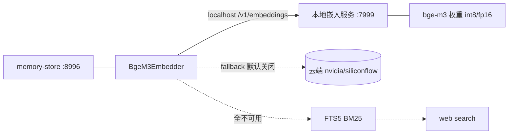
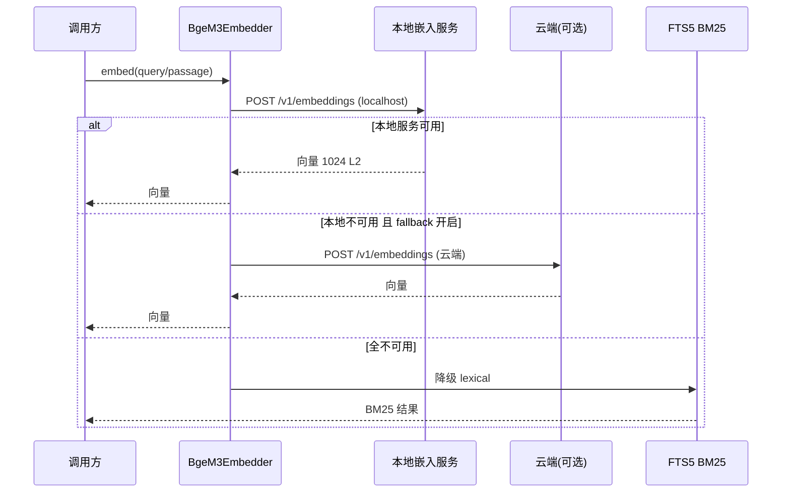

# bge-m3 全本地化部署方案设计（ADR-0012 v6 修订建议）

> 本文档为 ADR-0012 v6 修订建议，供主理人（team-lead）汇编后转交用户评审。
> 仅做架构/方案设计，不含实现代码。

## 一句话结论

将 bge-m3 以「**独立本地嵌入服务（方案 B）**」形式自托管，使**建库与召回均走本地推理**，云端 API 降格为**默认关闭、env 门控的可选 fail-over**，从而绕开 NVIDIA / SiliconFlow 当前阻塞，并回归「运行时显存归主模型 + 游戏」的初衷。

---

## 一、决策背景与动机

- **ADR-0012 v5（2026-07-24 用户逐项确认）** 为「双栖」设计：本地 bge-m3 GPU 权重离线建库 + 硅基流动托管 `BAAI/bge-m3` 免费 API 云端召回。核心依据是「同一模型 → 同一向量空间 → 召回有效」（空间一致性铁律）。
- **云端两条路当前均阻塞：**
  - **NVIDIA NIM `baai/bge-m3` 真机稳定 500**：两个不同 `nvapi-` key 下该模型全部 500（QA 穷举 5 种 payload 变体均 500），而同 key 同 base 的兄弟模型 `nv-embedqa-e5-v5` 返回 200 → 根因是 **NVIDIA 模型授权/条款未启用**，需用户在 NVIDIA API Catalog 接受 `baai/bge-m3` 条款才能解，属外部阻塞，非代码或 payload bug。
  - **SiliconFlow 欠费**：账户余额 -0.0239 元，key 有效但不可调用，需充值。
- **用户新需求**：「我们原本搞本地+云端 api。爬取的时候用本地，使用的时候用 api。现在我们部署 bge-m3 本地。」→ **全本地化**，建库与召回都走本地部署的 bge-m3。
- **全本地化同时回归项目初衷**：运行时显存优先服务主 VLM + 游戏，不再为召回预留云端带宽/额度，离线免费、无频率限制。

---

## 二、本地部署形态对比（A vs B）与推荐

| 维度 | 方案 A：进程内直载（in-process） | 方案 B：独立本地嵌入服务（dedicated server） |
|---|---|---|
| 形态 | memory-store 进程内 `SentenceTransformer` 直接加载（现有 `local` 模式已具备） | 独立 OpenAI 兼容 `/v1/embeddings` 服务（TEI / FastAPI+FlagEmbedding / 本地 NIM），memory-store 走 localhost HTTP 调用 |
| 新增组件 | 无 | 1 个本地服务（容器或 systemd 单元） |
| 网络跳数 | 0 | 1（localhost loopback，亚毫秒） |
| 空间一致性 | 天然（同进程同权重） | 天然（同权重、同预处理 `_prepare`） |
| memory-store 资源占用 | 占用其 RAM/VRAM（fp16 ~2.3GB / int8 ~600MB） | 几乎不占（仅 HTTP 客户端，轻量） |
| 运行时显存纪律 | 打破「召回 0 占用」（召回也占显存） | 保持：显存占用隔离在独立服务侧，memory-store(8996) 仍轻量 |
| 重启 / 热更 | 进程重启需重载权重（冷启动 5–15s） | 服务可独立热重载/重启，不影响 memory-store |
| 扩缩 / 替换模型 | 与 memory-store 绑死 | 量化档位、模型可独立替换、独立扩缩 |
| 与主 VLM 争用 | 直接争用（同进程同机） | 争用在服务侧，可用独立 GPU / 量化档位隔离 |
| 编排成本 | 低 | 中（需部署 / 健康 / 启动编排） |
| 复用现有代码 | 直接复用 `local` provider | 复用 `_embed_api` 路径，把 `EMBEDDING_API_BASE` 指向 localhost |

### 推荐：B 为默认，A 作为极简 / 降级备选

理由：

1. 用户措辞为「**部署**」，暗示一个可独立运维的本地服务，而非把模型塞进业务进程。
2. 原双栖设计即强调**解耦与显存纪律**——B 把模型 / 量化 / 显存占用从 memory-store 剥离，memory-store 保持轻量，召回仍走已被验证的 `_embed_api` 路径。
3. **「本地 NIM」与「云端 NIM 500」完全独立**：云端 NIM 500 是远程**授权条款未启用**导致的阻塞；本地 NIM 是**自托管容器**，权重由本地提供，无远程授权门槛，云端 500 不影响本地部署。若选 B 采用本地 NIM，不受该阻塞牵连。
4. A 仍保留价值：在无 GPU 的极简单机、或本地服务不可用时作为进程内降级路径。

### B 的具体实现候选（对 memory-store 而言等价：都是 localhost 的 OpenAI 兼容 `/v1/embeddings`）

- **首选 TEI（Text Embeddings Inference，HF）**：生产级、Rust、内置 `/health`、良好支持 bge-m3、支持 matryoshka / int8、并发与批处理稳健。
- **可接受替代：轻量 FastAPI + FlagEmbedding / BGEM3FlagModel**：复用现有 `_prepare` 语义、最低摩擦、完全可控，但需自管健康 / 并发。
- **本地 NIM**：可选，注意自托管镜像体积与启动编排（但无云端授权门槛）。

### 部署拓扑（示意）



---

## 三、云端角色建议

全本地化后，云端（nvidia / siliconflow）定位为 **可选 fail-over，默认关闭、env 门控**：

- **保留云端代码**（成本低、韧性高），但默认不启用。
- 仅在 `EMBEDDING_FALLBACK_ENABLED=true` 且本地主路径不可用时，按配置顺序尝试云端。
- 因同模型（`BAAI/bge-m3`）→ 同一向量空间 → 不破坏空间一致性，云端召回结果与本地一致，可作兜底。
- 默认主路径：本地服务；**fail-open 链**：本地服务 →（可选）云端 → FTS5 BM25 → web search。

**建议：不移除云端代码，仅将其退化为默认关闭的兜底**，避免因本地服务偶发宕机导致整体不可用。

---

## 四、资源预算表

| 项目 | fp16 | int8 | 备注 |
|---|---|---|---|
| 权重体积 | ~2.3 GB | ~600 MB | 下载 / 缓存到本地模型目录 |
| 推理 VRAM | ~2.3 GB | ~600 MB | 独立于 memory-store |
| 推理 RAM | 另需少量常驻 | 另需少量常驻 | 服务进程常驻 |
| 单条查询延迟（GPU） | ~10–50 ms | ~10–50 ms | 反快于云端 50–200ms |
| 单条查询延迟（CPU 降级） | 50–200 ms+ | 50–200 ms+ | 仅最后兜底，不推荐常态 |
| 批量建库吞吐 | 万级 chunk 分钟级 | 同量级 | 本地 GPU，离线免费 |
| 冷启动（权重加载） | 5–15 s | 3–8 s | 服务编排需等 ready |
| matryoshka 降维 | 1024 → 512 / 256 | 减索引体积 | 召回质量需 B9 验证 |

**推荐量化档位：int8 为默认**（~600MB VRAM，对显存 / 内存友好，几乎不损召回）；若宿主 GPU 显存充裕且 B9 金标集显示 fp16 明显更优，可升 fp16。维度维持 1024（matryoshka 仅在索引体积敏感时再降维）。

---

## 五、与现有 embedder 代码的衔接设计

现有 `services/memory-store/src/memory_store/embedder.py` 现状：`BgeM3Embedder`，provider ∈ {nvidia, siliconflow, local}，统一 `_prepare`（建库/召回共用），dim=1024，bge-m3 输出已 L2 归一化不二次处理；云端走 `client_factory.get_sync_client(provider)`；`health()` 同配置路径真实 ping。

### 改造要点（仅描述，不写完整代码）

1. **provider 抽象扩展**
   - 新增 `local_server` provider（本地嵌入服务，OpenAI 兼容）。
   - 保留 `local`（进程内，方案 A 降级）与 `nvidia` / `siliconflow`（云端兜底）。
   - 默认 `EMBEDDING_PROVIDER=local_server`。

2. **主 / 备选择逻辑**
   - 主路径 = `local_server`；`available()` 为假 → 若 `EMBEDDING_FALLBACK_ENABLED=true`，依序尝试 `nvidia` / `siliconflow`；全失败 → 上层 fail-open 转 FTS5 BM25。
   - `_prepare` 仍是单点预处理，本地服务侧镜像同一逻辑（保证空间一致性）。

3. **复用 `_embed_api` 路径**
   - `local_server` 走 `client_factory.get_sync_client("local_server")`，`EMBEDDING_API_BASE` 指向 `http://127.0.0.1:<EMBED_PORT>/v1`。
   - payload 维持 bge-m3 既有字段（`input_type` query/passage、`truncate:"NONE"`），输出 L2 归一化不二次处理。

4. **`health()` / `available()` 探活**
   - `local_server`：`health()` 对服务 `/health`（或 `/v1/models`）真实 HTTP ping；`available()` = 端点可达且模型已 loaded。
   - `local`（进程内）：`available()` 直接 True（权重在本地）。
   - 云端：维持原「有 key 才 available」。

5. **`/v1/providers/health` 真实 ping**
   - 对 `local_server` ping localhost 端点（不涉代理）；云端仅在其启用时 ping（保留 per-provider 代理）。

6. **`client_factory` per-provider 代理**
   - `local_server` = localhost，无代理需求；云端保留 per-provider 代理（一期仍直连，预留）。

7. **配置默认值（示意，非完整代码）**
   ```
   EMBEDDING_PROVIDER=local_server
   EMBEDDING_API_BASE=http://127.0.0.1:7999/v1
   EMBEDDING_LOCAL_MODEL=BAAI/bge-m3
   EMBEDDING_LOCAL_QUANT=int8          # fp16 | int8
   EMBEDDING_FALLBACK_ENABLED=false    # true 时启用 nvidia/siliconflow 兜底
   # 云端（兜底，默认不启用）
   NVIDIA_API_KEY=
   SILICONFLOW_API_KEY=
   ```
   - 嵌入服务端口建议 **7999**，避开 8996(memory-store) / 8099(webui 网关) / B3 / B4 代理端点，**不触前端契约**。

### fail-open 调用流（示意）



---

## 六、对 FTS5 中文不分词死穴的影响

- 全本地向量召回后，**中文检索在向量语义层完全可用**（bge-m3 原生中文语义），不再依赖 FTS5 做主召回。
- FTS5 BM25 因**中文不分词**导致召回质量差，本就是「死穴」；全本地向量化后它退为**纯兜底 / 最后 lexical 匹配**。
- **建议**：保留 FTS5 在 fail-open 链末端（仅当嵌入全不可用），但不再作为与向量并行的召回路径；可弱化其权重或仅在极端情况下触发。
- 前端 F1-F4 契约与 B3/B4 代理端点不变。

---

## 七、ADR-0012 v6 文本

```
ADR-0012: bge-m3 嵌入部署形态

状态（Status）: 提议（Proposed）—— 取代 v5
取代（Supersedes）: ADR-0012 v5（2026-07-24，双栖：本地建库 + 云端召回）
被取代于（Superseded by）: 待评审通过后定稿

上下文（Context）:
- v5 依赖 SiliconFlow 托管 bge-m3 做召回；当前 SiliconFlow 欠费、NVIDIA NIM
  baai/bge-m3 远程授权未启用（500），云端两条路短期均不通。
- 用户明确要求 bge-m3 全本地化：建库与召回均走本地部署的 bge-m3。
- 项目初衷：运行时显存优先归主 VLM + 游戏；应尽量减少业务进程对显存 /
  外部依赖的占用。

决策（Decision）:
1. 采用「全本地」：bge-m3 在本地完成建库与召回两类推理。
2. 本地部署形态默认选「独立本地嵌入服务（方案 B）」——自托管 OpenAI 兼容
   /v1/embeddings（首选 TEI，或以 FastAPI+FlagEmbedding 包裹；本地 NIM 亦可），
   memory-store 经 localhost HTTP 调用，复用现有 _embed_api 路径。
3. 进程内直载（方案 A / local provider）保留为极简 / 降级备选。
4. 云端（nvidia / siliconflow）降格为可选 fail-over，默认关闭
   （EMBEDDING_FALLBACK_ENABLED=false，env 门控）；启用时因同模型不破坏空间一致性。
5. 推荐量化档位 int8（~600MB VRAM），显存充裕可 fp16；dim 维持 1024。
6. FTS5 BM25 退为 fail-open 链末端纯兜底，不作为主召回路径。
7. 维持：USearch 侧车 HNSW + sqlite 真相源、每游戏一 .usearch 文件；
   memory-store 端口 8996、webui 网关 8099、前端 F1-F4 / B3-B4 契约不变。

后果（Consequences）:
+ 绕开云端授权 / 欠费阻塞，离线免费、无频率限制。
+ 召回延迟反可能更低（本地 GPU ~10–50ms vs 云端 50–200ms）。
+ memory-store 保持轻量，显存占用隔离在独立服务侧，符合解耦 / 显存纪律。
+ 同模型同空间，空间一致性铁律不变。
- 打破原「运行时显存 0 占用」目标：召回现在占用本地服务显存
  （int8 仅 ~600MB，可控）。
- 新增一个需部署 / 健康 / 启动编排的本地服务（运维面扩大）。
- 需解决模型权重分发（~2.3GB fp16 / ~600MB int8 下载与缓存位置）。
- 需以 B9 金标集验证 int8 不损召回质量（落地门禁）。
```

---

## 八、有序任务分解（部署编排 + 代码改造）

> 责任标注：D = 部署编排（DevOps / 架构）；C = 代码改造（后端）。P0 必做，P1 重要，P2 可选。

| ID | 任务 | 类型 | 依赖 | 优先级 |
|---|---|---|---|---|
| T-D1 | **模型权重获取与缓存**：下载 `BAAI/bge-m3`（fp16 / int8）至本地模型目录（如 `/opt/models/bge-m3` 或 `./models`），记录体积与离线分发方式 | D | 无 | P0 |
| T-D2 | **本地嵌入服务打包**：Dockerfile / docker-compose 或 systemd unit（TEI 或 FastAPI+FlagEmbedding），暴露 `:7999/v1/embeddings` 与 `/health` | D | T-D1 | P0 |
| T-D3 | **启动与健康编排**：compose 启动顺序 / systemd `Wants`+`After`+`Healthcheck`；memory-store 等待服务 ready 后再接受建库 / 召回 | D | T-D2 | P0 |
| T-D4 | **权重与配置分发**：`.env` 模板、离线安装说明、int8 / fp16 切换文档 | D | T-D1 | P1 |
| T-C1 | **embedder provider 改造**：新增 `local_server` 为默认主路径；保留 `local`(A) 与 `nvidia`/`siliconflow`(兜底)；实现主 → 备选择逻辑 | C | 无 | P0 |
| T-C2 | **`health()` / `available()` 与 `/v1/providers/health`**：本地服务走 HTTP 真实 ping；云端仅启用时 ping | C | T-C1 | P0 |
| T-C3 | **配置默认值与 `client_factory`**：`EMBEDDING_PROVIDER=local_server`、API base 指向 localhost、fallback env 门控；local_server 无代理、云端保留代理 | C | T-C1 | P0 |
| T-C4 | **fail-open 链更新**：本地服务 →（可选）云端 → FTS5 BM25 → web search；FTS5 降为末端 | C | T-C1, T-C3 | P1 |
| T-C5 | **测试与 B9 金标验证**：`services/memory-store/tools/verify_nvidia_recall.py` 适配本地；int8 vs fp16 召回质量对比，作为合并门禁 | C | T-D3, T-C1 | P0 |

### 执行顺序建议

1. **T-D1（权重）→ T-D2（打包）→ T-D3（编排）** 形成可运行的本地嵌入服务。
2. **T-C1 → T-C2 → T-C3** 改造代码；T-C4 随 C1 / C3 完成。
3. **T-D3 + T-C1 就绪后跑 T-C5（B9 验证）**，通过方可合 PR（建议将 int8 不劣于 fp16 阈值设为合并门禁）。
4. **T-D4** 与 D 系列并行收尾（配置模板 / 离线分发文档）。

> 说明：T-C1~T-C5 对应 PR #38 中 `embedder.py` 的修订（该 PR 已于 2026-07-27 合入，`services/memory-store/tools/` 下 B9 金标验证脚手架 `golden_recall_set.json` / `verify_nvidia_recall.py` / `eval_golden_recall.py` 已落地）。

---

## 九、风险与待确认项

- **本地服务可用性与自愈**：服务崩溃 / 重启如何自愈（systemd `Restart=always` 或 compose `restart: unless-stopped`）；memory-store 侧需带重试与短暂降级到 `local`(A)。
- **与主 VLM 显存争用**：需实测宿主 GPU 显存余量；int8(~600MB) 通常可控，fp16(~2.3GB) 需评估；必要时嵌入服务绑定独立 GPU 或走 CPU 降级。
- **模型权重分发**：~2.3GB(fp16) / ~600MB(int8) 下载与缓存位置、是否随镜像预置、离线环境如何分发。
- **int8 是否损召回质量**：必须用现有 B9 金标集（`services/memory-store/tools/golden_recall_set.json` + `services/memory-store/tools/verify_nvidia_recall.py`）验证；建议将「int8 召回不劣于 fp16 阈值」作为合并门禁。
- **冷启动对 memory-store 启动的影响**：编排需等服务 ready，避免建库 / 召回在权重未加载时失败；可加 readiness 探针。
- **B 实现选型未定**：TEI vs FastAPI+FlagEmbedding vs 本地 NIM——建议以「最低运维摩擦 + 内置健康端点」为准，TEI 优先。
- **端口规划**：嵌入服务端口（建议 7999）须避开 8996 / 8099 / B3 / B4，确认不与现网冲突。
- **CPU 降级可行性**：无 GPU 环境召回延迟 50–200ms+，仅作最后兜底，不推荐常态；需与用户确认是否接受。
- **前端契约**：本方案不要求前端改动；F1-F4 / B3-B4 端点保持，已与团队约束一致。
