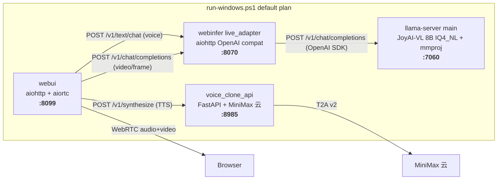
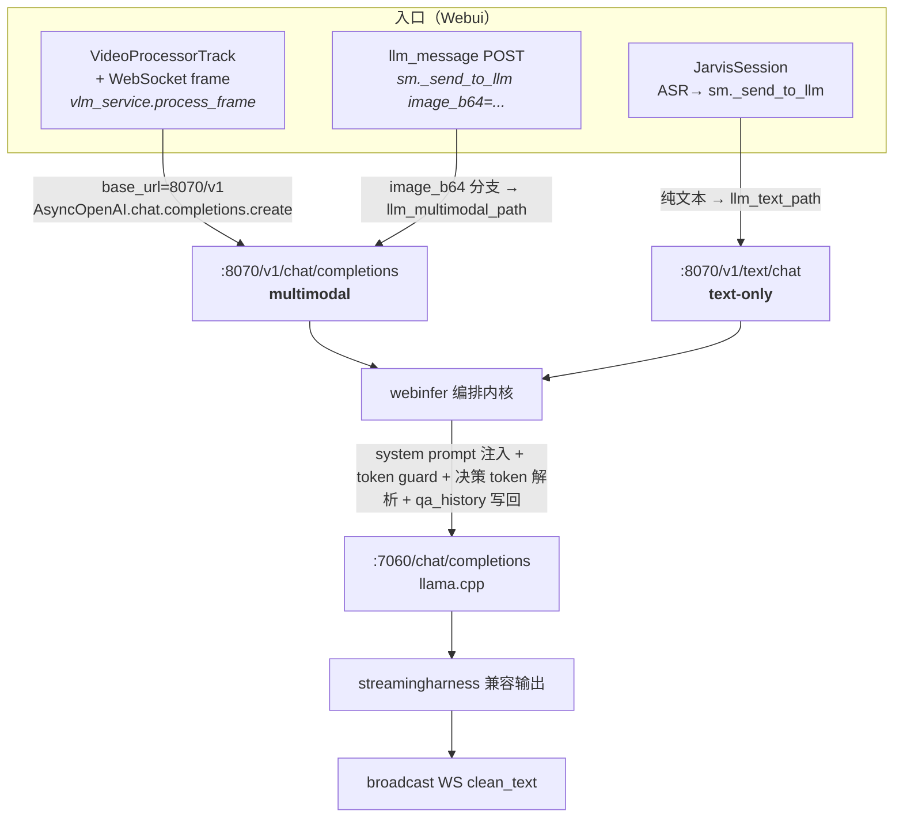
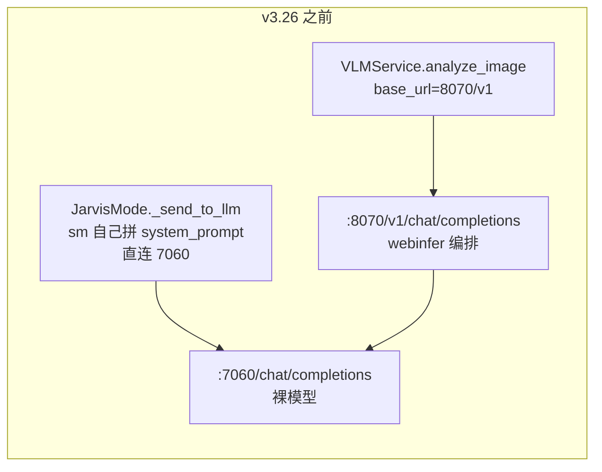
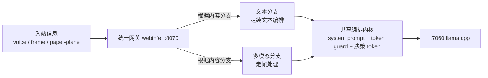
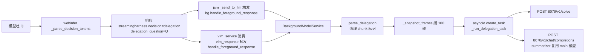

# 项目现状（2026-07-13，v3.37 唯一权威）

> **唯一权威快照**：本文档是当前项目现实拓扑、模块流程、端口、风险表的唯一来源。
> 配套专题文档：`llm-path-consolidation.md`（B 选项实施合同，已 ✅ 实施）/ `hybrid-wake-confirm.md` / `kws-recall-optimization.md` / `memory-store-skeleton-spec.md` / `webui-asr-input-state.md` / `webui-kws-listening-chain.md`。
> 决策记录：见 `doc/adr/`。
> 历史弃用文档（仅参考）：`../deprecated/README.md`（说明为何保留 + 处置规则；不要据此实施）。

> **目的**：让团队同步"v3.37 单 LLM 网关 + 双入口"实施后的真实拓扑。
> **读者**：所有要改 / 排错 / 调流程的开发者。
> **基线**：所有图都基于 `services/` 实际可执行代码 + `services/scripts/run-windows.ps1` 的默认启动计划。
> **配套**：实施合同 `doc/specs/2026-07-13-llm-path-consolidation.md`（B 选项，已 ✅ 实施）；专题 spec 见上方列表。

---

## 0. 一句话

**WebUI 8299 → Webinfer 8070 → llama-server 7060 一条干线**，干线的中段有 **HTTP 路由分叉**（`/v1/text/chat` 拒绝帧，`/v1/chat/completions` 接受帧），但所有 LLM 编排（system prompt 注入、token guard、决策 token 解析、qa_history 累积、memory warmup）只发生在 **webinfer** 内部。Jarvis 语音、视频、纸飞机三条入口全部走这条干线。

不是"两条独立的 LLM 链路"，而是 **HTTP 入口分两个 → 共享一个编排内核 → 汇聚到一个 llama.cpp 后端**。

---

## 1. 现状架构图（v3.37 后）

### 1.1 进程拓扑（`start-joyai.ps1 default` 模式实际拉起）



**关键事实**：
- Webui 不再持有任何指向 `:7060` 的直连；所有 LLM 都从 8070 进。
- Webinfer 是无权的编排层（不装权重，纯 aiohttp + OpenAI SDK client）。
- `:7060` 是 **唯一的 LLM 后端**。

### 1.2 LLM 网关 HTTP 契约（只有两个 POST 端点涉及 LLM）

| 端点 | 接受 | 拒绝 | 编排内核入口 |
| --- | --- | --- | --- |
| `POST /v1/text/chat` | 纯文本 messages | `image_url` / `image` part、`data:image/...;base64` 字符串 | `_handle_text_payload` |
| `POST /v1/chat/completions` | 文本 + image_url / 帧引用 | 单 image 数 > N 时报 400 | `_handle_chat_payload` |

两个端点都最终调用同一个 `client.chat.completions.create(...)` 走 OpenAI SDK → `:7060/chat/completions`，区别仅在"是否触发帧处理 + chunk 摘要 + 异步 summarizer pipeline"。

### 1.3 三大入口去哪儿



- **V1 视频帧 / 屏幕分享**：`vlm_service.AsyncOpenAI(base_url=8070/v1)` → multimodal。
- **V2 纸飞机**：`jarvis_mode._send_to_llm(text, image_b64=...)` 走 multimodal path。
- **V3 语音**：`jarvis_mode._send_to_llm(text)` 走 text-only path。

---

## 2. 与之前（v3.26）的对比

### 2.1 旧拓扑（用户原话"两条独立的 LLM 链路"）



| 维度 | v3.26 之前（两条独立路径） | v3.37 之后（一条干线） |
| --- | --- | --- |
| 语音 text | webui → **`7060` 直连**（绕过 webinfer） | webui → `:8070/v1/text/chat` 走 webinfer |
| 视频/纸飞机 | webui → `:8070/v1/chat/completions` | webui → `:8070/v1/chat/completions`（不变） |
| System prompt | jarvis 自己拼 `llm_system_prompt` 字符串 | webinfer 统一拼（BT-7274 + Local Wiki） |
| Token guard | **缺失**（拼多少发多少） | webinfer 跑 `_trim_messages_to_ctx` |
| 决策 token 解析 | **缺失**（`</silence>` `</delegation>` 会原样进 TTS） | webinfer 跑 `_parse_decision_tokens` |
| qa_history 累积 | **缺失**（每轮只有 jarvis 进程内 deque） | webinfer 写 `state.memory_state.qa_history` |
| Memory warmup | 不走 | webinfer 启动时 warm blocks |
| 失败兜底 | 直接 502 透传给前端 | webinfer 包成 `{type: vlm_response, text: [LLM error]}` |

### 2.2 用户的"以为单链路"是对的

> "我以为所有信息走一个链路、链路上有分支处理回到链路上"

直觉上的链路形态：



这就是 v3.37 的真实形态。v3.26 之前是 **没有 GATEWAY 这一层**——voice 不进 gateway，直接穿到 LLM。

---

## 3. 各模块流程图

### 3.1 webui / jarvis_mode `_send_to_llm`（语音入口核心）

```mermaid
flowchart TB
  start([entry: ASR final 文本 或 llm_message POST]) --> route{route by media}
  route -->|image_b64 提供| multi[":8070/v1/chat/completions<br/>content=[text, image_url]"]
  route -->|纯文本| text[":8070/v1/text/chat"]
  multi --> read_decision[读 streamingharness.decision]
  text --> read_decision
  read_decision --> d{decision?}
  d -->|silence| skip[tts 跳过<br/>broadcast 空串]
  d -->|delegation| bg[委托 BackgroundModelService<br/>handle_foreground_response]
  d -->|response| tts[call voice_clone_api :8985/synthesize]
  bg --> rebroadcast[broadcast 前台短句]
  tts --> broadcast[broadcast 干净文本<br/>on_llm_response]
  rebroadcast --> end([exit])
  broadcast --> end
  skip --> end
```

**关键点**：
- 签名 `async def _send_to_llm(self, text, *, stream_tts=True, image_b64=None)` 保留向后兼容。
- 决策 token 在 webinfer 一侧已剥离；jarvis 这层只读 `streamingharness.decision` 字段。
- `self._background_service` 由 `JarvisSessionManager.create_session` 注入（通过 `server.sessions[session_id]["background_service"]`）。

### 3.2 webui / vlm_service `process_frame` / `analyze_image`（视频入口）

```mermaid
flowchart TB
  rt[WebRTC video track<br/>VideoProcessorTrack] --> sample[抽帧 1 fps JPEG]
  ws[WebSocket frame<br/>screen capture] --> sample
  paper[llm_message image_b64] --> jt[jarvis_mode._send_to_llm image branch → webinfer multimodal]
  sample --> vlms[VLMService.analyze_image]
  vlms --> jpeg[JPEG → base64]
  jpeg --> msg[组装 content=[text, image_url] messages]
  msg --> openai[AsyncOpenAI base_url=8070/v1<br/>POST /v1/chat/completions]
  openai --> fin[decode choices[0].message.content]
  fin --> bg2{模型输出是否含 </delegation>}
  bg2 -->|no| broadcast[vlm_response WS broadcast]
  bg2 -->|yes| hand_off[BackgroundModelService.handle_foreground_response<br/>攒 100 帧 JPEG → POST 8079/v1/solve]
```

### 3.3 webinfer / live_adapter 编排内核

```mermaid
flowchart TB
  hs[HTTP handler<br/>handle_chat_completions OR handle_text_chat] --> lock[lock state]
  lock --> mp{messages 合法性}
  mp -->|text 端 + image_url| rj[400 error]
  mp -->|通过| sid[_request_session_id]
  sid --> backend[_resolve_backend<br/>多 backend 路由]
  backend --> pay{text-only path?}
  pay -->|yes| tp[_handle_text_payload]
  pay -->|no| mp2[_handle_chat_payload]
  tp --> warm[memory-store.warmup fire-and-forget]
  warm --> sys[_build_memory_prompt<br/>character + Local Wiki]
  sys --> replace{caller-supplied system?}
  replace -->|yes| repl[替换为 composed]
  replace -->|no| skip[保留 caller]
  repl --> guard[_trim_messages_to_ctx 字符预算]
  skip --> guard
  guard --> call[client.chat.completions.create<br/>:7060 OpenAI SDK]
  call --> parse[_parse_decision_tokens<br/>剥离 /silence /response /delegation]
  parse --> up_qa[_update_text_qa_history<br/>仅 text path]
  parse --> fmt[_chat_completion_response<br/>附 streamingharness metadata]
  mp2 --> guard2[_handle_chat_payload 多模态管线<br/>帧持久化 + chunk 摘要 + 异步 summarizer]
  guard2 --> call
  fmt --> done[200 JSON]
  up_qa --> done
```

**text path 与 multimodal path 的关键不同**：
- text path：每轮同步写 qa_history；不触发 chunk 摘要；不调用 summarizer。
- multimodal path：仅在 chunk 翻转时 `archive_chunk_response_records` 写 qa_history；触发 chunk 摘要 + long-term memory；调用 async summarizer pipeline。

但是 **同一 `state.memory_state` 对象**，两路都读写 → **qa_history 在同一会话内对两路都可见**。

### 3.4 委派（delegation）路径共享



**两边（Jarvis + VLM）现在用同一个 `BackgroundModelService` 实例**，都通过 `server.sessions[session_id]["background_service"]` 注入。

---

## 4. 关键不变量（实施合同 §3.3 验证）

- ✅ `_send_to_llm` 签名未改（向后兼容）
- ✅ Webinfer `_handle_text_payload` 拒绝任何 image_url content（400）
- ✅ caller-supplied system message 被 composed system prompt **替换**（不是追加）
- ✅ composed 为空时只转发 caller messages（不做空 system 注入）
- ✅ Decision token 始终在 webinfer 剥离；jarvis 看到的 `content` 永远是干净文本
- ✅ TTS 收到的是干净文本（`</response> hi` 不会念出 token）
- ✅ Silence → jarvis 跳过 TTS + broadcast 空串
- ✅ Delegation → jarvis 调 `BackgroundModelService.handle_foreground_response`，跳过前台 TTS

---

## 5. 测试现状

| 服务 | 通过 | 备注 |
| --- | --- | --- |
| `services/webinfer/tests/` | **52 passed** | 包含 slice 1+2（text_chat_endpoint 9 + text_chat_prompt 5）+ 原有 memory/prompt guard/system 测试 |
| `services/webui/tests/`（去掉 e2e） | **93 passed** | 含 slice 3+4（jarvis_webinfer_routing 7 + jarvis_background_wiring 3）+ 原有 jarvis/asr/webui 测试 |
| `services/webui/tests/test_jarvis_webinfer_e2e.py` | **0/3（hang）** | TestClient 构造要 `running event loop`，pytest-asyncio auto 模式下 fixture 上下文不是 async。**当前是 open item**（见 §6） |

---

## 6. 当前已识别的风险 / open items

### 6.1 阻塞 / 半阻塞

1. **`test_jarvis_webinfer_e2e.py` 3 个 e2e 测试 hang**（详见另一会话 handoff）。推荐方案 D：用 `aiohttp.web.AppRunner` + 后台线程事件循环 + `httpx.Client` 同步调用。预计 30-60 行改完。
2. **文档漂移**：
   - `doc/specs/2026-07-13-current-state.md` §0、§1.1、§3.2 仍写"Jarvis 短对话直连 7060"+" 4 进程 default plan（webinfer 不在其中）"，已与实际不符。
   - `doc/specs/2026-07-13-llm-path-consolidation.md` §1 状态待改"已实施（v3.37）"。
   - 这两个不修复，新人会被误导。

### 6.2 结构性风险（不会立刻爆，但设计层面要清楚）

3. **`webinfer` 成为新 SPOF**：
   - v3.26 之前：webui 语音链绕过 webinfer，webinfer 挂了视频链仍可用。
   - v3.37 后：三条入口都进 webinfer，webinfer 挂了 → **整个 LLM 链路全断**（包括语音）。
   - 实施合同 §5 明确"必须显式失败，不回退到 7060 直连"——这个决定要记在 ADR 里（ADR 还没写）。
4. **决策 token 默认 fallback**：
   - jarvis `_send_to_llm` 在 `streamingharness` 缺失时 `decision = "response" if response else "silence"`。
   - 但 webinfer 不会真的返回空 streamingharness，所以是兜底。**但如果 webinfer 在新版本改 `streamingharness` schema，jarvis 不会报错，会沉默 TTS 整段原始响应**——这是 silent regression 的一个口子。
5. **`_background_service` 注入时序**：
   - `JarvisSessionManager.create_session` 中是"lazy 一次性绑定"（`_bind_background_service` 函数定义了但只调一次）。
   - **如果 `server.session_cleanup` 重建 session dict 后，没人再触发 `_send_to_llm` 重新绑定 → 旧（closed）BackgroundModelService 引用泄漏**。
   - 简化方案：把绑定放到 `_send_to_llm` 内部"用时再查"，而不是 create_session 时一次。
6. **`VLMService.api_base` 是全局**：
   - `default_vlm_config` 在 `server.py` 模块顶层声明，所有 session 共享一个 webinfer URL。
   - 多实例 webui（例如未来多 user 隔离）上线时会冲突。需要一个 per-session 的 override 路径。
7. **`_handle_chat_payload` 与 `_handle_text_payload` 的 qa_history 写入策略不对称**：
   - text path：每轮写。
   - multimodal path：chunk 翻转时写。
   - 同 session 内：如果用户先发文本再发帧再发文本，qa_history 三次写入（2 文本 + 1 chunk 归档）。`build_dynamic_system_content` 读时会全部看到。**但写入语义不同**——文本对写入 content 是当前轮；多模态对写入是 chunk 内所有 turns 的 queries+responses。建议写 ADR 明确。

### 6.3 不会爆但要知道

8. **`DefaultVLMConfig.api_base` 与 `JarvisConfig.llm_api_url` 两套配置**：
   - 视频：`default_vlm_config.api_base`（argparse `--api-base`）
   - 语音：`JarvisConfig.llm_api_url`（`JARVIS_LLM_API_URL` env 或 dataclass default）
   - 默认都指向 8070/v1，但用户改 env 时容易只改一个。
9. **`/v1/chat/completions` 的 `_forward_text_only` 分支**：
   - 如果调 multimodal 端点但 0 帧，自动降级到 forward text only（不写到 qa_history）。这条快速通道存在但实现合同 §7 标注"不在本次范围"，需要确认在 jarvis_mode 里没有被意外使用。
10. **Stream 化未实现**：
    - webinfer 两个端点都是完整 JSON 响应，不是 SSE。前端靠 broadcast json 一次性消费。如果遇到 200+ tokens 长回答，TTFB 时间会变长。可作为下一步优化。

### 6.4 不需要立刻处理但是已知

11. **run-windows.ps1 默认 4 进程**：memory-store / hermes / background-agent 在代码层完整但默认不拉起，按 env opt-in。`default` 计划列出。
12. **WebRTC 双模块 hack**（`server.py` 顶部 sys.modules.setdefault）：老问题，影响范围可控；未来如果改 entry point 要记着。
13. **JARVIS_LLM_API_URL** 旧值是 7060 在 README 等位置可能还残留——用户升级时要看一眼 env 没传。

---

## 7. 用户原始疑问的直接回答

> Q: "我以为所有信息走一个链路、链路上有分支处理回到链路上，但事实上有两个不同的路走 LLM 回复，视频帧不能通过 LLM 纸飞机文字走，只能走视频帧 LLM 服务"

**这是 v3.26 之前的正确观察**。结构是：

```
        ┌─ voice  ──→ jarvis_mode._send_to_llm ──────────────→ 7060 (直连)
        │
人 ──┤                                                  ┌─→ webinfer ─→ 7060
        └─ frame/纸飞机──→ vlm_service / jarvis (image_b64) ──┘
```

两条路径在 `7060` 之前完全不共享编排，voice 那条还绕过了 webinfer。

**v3.37 的修复**：

```
        ┌─ voice text ────────────┐
        │                          │
人 ──┤  frame/纸飞机 ─────────────┼─→ webinfer (:8070) ─→ llama-server (:7060)
        │                          │
        └─ 各路分支由 webinfer HTTP 路由分叉决定
              ↓                       ↓
        _handle_text_payload    _handle_chat_payload
              ↓                       ↓
              └── 共享同一段 state.memory_state ──┘
```

**一条物理链路 + 两个 HTTP 入口 + 一个共享编排内核**。
- 物理链路：`webui → webinfer → llama.cpp`
- HTTP 入口分叉：`/v1/text/chat` vs `/v1/chat/completions`
- 共享内核：webinfer `live_adapter.py` 内 `_build_memory_prompt` + `_trim_messages_to_ctx` + `_parse_decision_tokens` + `_update_text_qa_history` + `build_dynamic_system_content`

**这就是"链路上有分支处理回到链路上"的实现**：
- 链 = `webui → webinfer → llama-server`
- 分支 = webinfer 根据 HTTP 端点选不同 `_handle_*_payload`
- 回到链 = 两路都写同一份 `state.memory_state`（qa_history、long_term、memory_blocks），下一轮就是同一份上下文

你看到的"两个 LLM 路径"问题，根因是 v3.26 缺了 webinfer 这一层 → 现在补上了。

---

## 8. 待跟进清单（不是 TODO，是观察项）

1. ✅ Slice 1-4 完成（webinfer 52 + webui 93 测试全绿）
2. 🟡 Slice 5 e2e 测试 hang → 改方案 D（HttpRunner + threading）
3. 🟡 更新 `2026-07-13-current-state.md` 同 §1 + §3.2 反映 v3.37
4. 🟡 更新 `2026-07-13-llm-path-consolidation.md` §1 状态改"已实施"
5. 🟡 写 ADR `0006-llm-gateway-single-entrypoint.md` 把"webinfer SPOF + 显式失败不回退"的设计决策记下来
6. ⚪ `_background_service` 改为按需 late binding
7. ⚪ `qa_history` 写入策略多模态 vs 文本不对称，写 ADR 明确
8. ⚪ Run-windows.ps1 检查 `JARVIS_LLM_API_URL` 默认注释（默认已指 8070，无需改）

---

> **本文档是项目现状的唯一权威快照**。改动请直接修改本文件，commit message 标注 `doc(specs): current-state`。
