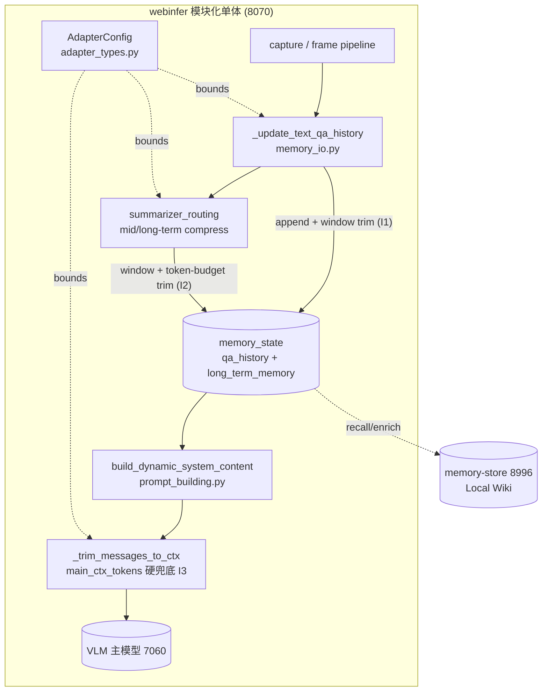

# 优化方案与架构 · 上游同步 + 上下文溢出根治 · 2026-07-23

> 输入两份文档的对照产物：
> - **更新参考文档**：`reports/upstream-review-20260722.md`（上游 `jd-opensource/JoyAI-VL-Interaction` 近 2–3 周变更调研，含 PR #25 上下文溢出修复、smoke 预热、vLLM flag、端口表、部署 profile）。
> - **我们的问题文档**：`reports/architecture-review-20260722.md` + `reports/architecture-review-20260723.md`（本 fork 自身架构 review，含 B4 TTS 端口三分裂、Jarvis 文档缺口、ADR 引用缺口等）。
>
> 方法：**只读 grep 复核了本 fork 当前代码**，所有"现状"结论均来自实地核验，非口头推断。本文是**方案 + 架构**，不改动任何 tracked 代码；落地交给后端对话实现、测试对话回归（符合本仓库多对话分工纪律）。

---

## 0. TL;DR（一句话）

上游 PR #25 修的"长会话上下文溢出"**在我们 fork 里仍然部分存活**：`qa_history` 仍无界增长（`memory_io.py:146` 只 append 不 trim），`long_term_memory` 只按条数裁剪、**缺 token 预算循环**（`summarizer_routing.py:190-199` 算了 `token_count` 却没用它裁剪）。我们 fork 自己加的 `main_ctx_tokens` 字符预算**只管对话轮次、不管 system content 里的 qa_history 块**，所以这条溢出路径没被挡住。其余上游轻量改进（smoke 预热、vLLM flag、端口偏移表、profile 抽象）可选择性借鉴；LiveKit 分支与整 Docker 化**不抄**。

---

## 1. 对照矩阵：上游更新 ↔ 我们问题文档 ↔ 我们代码现状 ↔ 决策

| # | 上游更新（参考文档出处） | 我们问题文档对应项 | 我们代码现状（已核验） | 决策 | 优先级 |
|---|---|---|---|---|---|
| 1 | PR #25 根因1：`qa_history` 无界增长（`upstream-review` §4.1） | 隐含问题：同源码祭祖，长会话必崩 | **仍存活**：`memory_io.py::_update_text_qa_history:138-146` 只 `append`，无 window；`AdapterConfig` 无 `qa_history_window` | **移植**（fork 专属映射，见 §2.1） | **P0** |
| 2 | PR #25 根因2：`long_term_memory` 只 append 不重压缩（`upstream-review` §4.2） | 同上 | **部分存活**：`summarizer_routing.py:190-199` 有 count-window 裁剪 + 算了 `token_count` 但**无 token 预算 while 循环**；`AdapterConfig` 无 `long_term_memory_max_tokens` | **移植**（补 token 预算循环，见 §2.2） | **P0** |
| 3 | `main_ctx_tokens` 字符预算（本 fork 自有，上游 PR #25 当时无） | — | **已存在**且好：`prompt_building.py:72 _trim_messages_to_ctx` + `adapter_types.py:36 main_ctx_tokens=16384`；但**只裁对话轮次，不裁 system content 的 qa_history/long_term 块** | **保留作硬兜底**，与 #1/#2 形成双层防护（见 §3.4） | 已具备 |
| 4 | smoke 预热 `services/webinfer/smoke.py`（`upstream-review` §5） | 我们 `start-joyai.ps1` 缺首请求预热，首请求 20–30s 卡顿 | 我们**无** `smoke.py` | **采纳**：新增 `scripts/smoke.py`（urllib 单文件，不引 requests） | **P1** |
| 5 | vLLM flag：`enable-prefix-caching` / `enable-chunked-prefill`（`upstream-review` §7） | 我们 start 脚本未审计 | 待查（start 脚本位置待确认） | **审计 + 启用**（长 prompt 性能） | **P2** |
| 6 | 端口表 fork 偏移（`upstream-review` §6） | **B4**：TTS 端口三分裂（8985/8991/8992）vs ADR0004 单端口；防火墙 inbound 漏放 | 代码确为三端口，`ARCHITECTURE.md` §3/§10 仅写 8985 | **修文档 + 防火墙规则**（我们自有问题，非上游同步） | **P0（我们侧）** |
| 7 | 部署 profile 抽象 `.env`（`upstream-review` §8） | 我们 `start-joyai.ps1` 散落、端口硬编码 | 散落 | **轻量采纳**：引入 profile（本地调试/单卡 3090/4 卡 5090），`.env` 化 | **P3** |
| 8 | `images.lock` 类比（`upstream-review` §9） | 模型/镜像 tag 防漂移 | 无 | **轻量采纳**：写 `models.lock` 锁 vllm/ASR/TTS image tag | **P3** |
| 9 | **不抄**：`livekit` 分支（`upstream-review` §10.1） | 我们用 WebRTC 直连，需求不对位 | — | **不抄** | — |
| 10 | **不抄**：整 Docker 化 `container/`（`upstream-review` §10.2） | 主力用户在 Win 本地消费级单卡 | — | **不抄**（仅抄 #4/#5/#6 轻量项） | — |
| 11 | — | **A1/A2**：Jarvis 常驻语音模式文档/交叉引用缺口 | `doc/subsystems/jarvis-mode.md`(60KB) 存在，但 `ARCHITECTURE.md` 未交叉引用/顶层摘要 | **补文档交叉引用**（设计本身不缺，仅文档缺口） | **P2** |
| 12 | — | **C6**：ADR0008 未在 `ARCHITECTURE.md` §7 引用 | §7 仅列 ADR0001~0007 | **补引用** | **P3** |
| 13 | — | **C5/B3**：WebUI 双角色 + memory 多后端澄清 | WebUI 双角色属实；memory 多后端是桩（仅 sqlite 活） | **补两句澄清** | **P3** |

> 关键认知：**#1/#2 既是"上游修的 bug"，也是"我们自己的 latent bug"** —— 因为我们 fork 自同一祖先代码，且已核验确认未完全修复。这是本次优先级最高、收益最大的同步项。

---

## 2. 核心优化方案（P0）：上下文窗口边界化

### 2.1 根因1 — `qa_history` 窗口裁剪（fork 专属映射）

**上游写法**：在 `archive_chunk_response_records` 加 `window` 参数。
**我们的差异**：fork 已把 qa_history 的 append 拆到独立方法 `_update_text_qa_history`（`memory_io.py:118`），而三处 `archive_chunk_response_records` 调用（`session.py:386` / `infer_loop.py:342` / `memory_io.py:164`）是 **chunk 输出落盘记录，与 qa_history 无关**。因此窗口逻辑应落在 `_update_text_qa_history`，**不要**动 `archive_chunk_response_records`。

**改动点（精确）：**

1. `adapter_types.py` 的 `AdapterConfig` 新增字段（紧挨 `keep_qa_history`）：
   ```python
   keep_qa_history: bool = True
   qa_history_window: int = 40   # 0 = 禁用(旧行为:无界)
   ```
2. `memory_io.py::_update_text_qa_history`（line 146 append 之后）追加：
   ```python
   window = int(self.config.qa_history_window or 0)
   if window > 0 and len(qa_history) > window:
       del qa_history[: len(qa_history) - window]
   ```
3. `app.py::parse_args` 新增 CLI/env：
   ```python
   "--qa-history-window", env_var "QA_HISTORY_WINDOW", default 40, 0=disable
   ```

**为什么安全（可回退性）：** `0` = 完全回到旧行为；配置门控，改坏一行 env 即可回退，符合 ADR 可逆性原则。

### 2.2 根因2 — `long_term_memory` token 预算循环（补我们的半成品）

**现状核验**：`summarizer_routing.py:190-199` 已有
```python
window = int(self.config.long_term_memory_window or 0)
if window > 0 and len(state.long_term_history) > window:
    del state.long_term_history[: len(state.long_term_history) - window]
    ...
token_count = self.summarizer.estimate_tokens(state.memory_state["long_term_memory"])
```
注意到 `token_count` **算完没用** —— 这就是上游 PR #25 缺的那段 token 预算循环。基础设施（tokenizer、`estimate_tokens`、重建逻辑）已就位，只差一个 `while`。

**改动点（精确）：**

1. `adapter_types.py` 新增（注意与既有 `long_term_max_tokens=2000` 区分 —— 那是"单次生成上限"，新字段是"累计重建文本预算"）：
   ```python
   long_term_memory_max_tokens: int = 4000   # 0 = 禁用
   ```
2. `summarizer_routing.py:190` 区块改写为：
   ```python
   window = int(self.config.long_term_memory_window or 0)
   token_budget = int(self.config.long_term_memory_max_tokens or 0)

   def _rebuild_long_term_memory() -> str:
       return "\n\n".join(
           entry["compressed_text"].rstrip()
           for entry in state.long_term_history
           if entry.get("compressed_text")
       )

   trimmed = False
   if window > 0 and len(state.long_term_history) > window:
       del state.long_term_history[: len(state.long_term_history) - window]
       trimmed = True
   if token_budget > 0:
       while (
           len(state.long_term_history) > 1
           and self.summarizer.estimate_tokens(_rebuild_long_term_memory()) > token_budget
       ):
           del state.long_term_history[0]
           trimmed = True
   if trimmed:
       state.memory_state["long_term_memory"] = _rebuild_long_term_memory()
       token_count = self.summarizer.estimate_tokens(state.memory_state["long_term_memory"])
   ```
3. `app.py::parse_args` 新增 `--long-term-memory-max-tokens` / env `LONG_TERM_MEMORY_MAX_TOKENS`。

**`estimate_tokens` 精度风险（已核验 `memory_summarizer.py:455`）：** 当 `summarizer_model`（`/tmp/models/Qwen3-VL-4B-Instruct`）tokenizer 加载成功 → 真实 tokenizer 编码，准；加载失败 → 退化为 `len(text)//4` 字符启发式，粗。因此 token 预算是**尽力而为**、非硬保证。这正是 §3.4 把 `main_ctx_tokens` 留作**硬兜底**的理由。

### 2.3 默认值与层间关系（避免双重裁切过度丢上下文）

| 边界 | 字段 | 默认 | 角色 |
|---|---|---|---|
| 短期对话记忆 | `qa_history_window` | 12（**已拍板 2026-07-23**） | 软裁剪（memory-state 侧） |
| 长期记忆条数 | `long_term_memory_window` | 40（已存在） | 软裁剪 |
| 长期记忆 token | `long_term_memory_max_tokens` | 1800（**已拍板 2026-07-23**） | 软裁剪（累计预算） |
| 最终消息硬上限 | `main_ctx_tokens` | 16384（已存在） | **硬兜底**（请求侧） |

经验证：16384 给 12 条 qa + 1800 token 长期记忆留极大余量，正常绝不触发 `main_ctx_tokens` 兜底；兜底只在 tokenizer 退化或极端长会话时救场。
**取舍（owner 决策 2026-07-23）**：`qa_history_window=12` / `long_term_memory_max_tokens=1800` 比初稿 40/4000 更保守——优先**零溢出 + 更低每轮 prompt token 成本**，代价是单会话内可引用的近期上下文变短（≈12 轮短 utterance + ≤1800 token 长期摘要）。**缓解**：跨会话/重要事实已外置到 `memory-store`(8996, Local Wiki) 召回，进程内 `qa_history`/`long_term_memory` 仅作"工作记忆"，收紧不丢持久知识。

### 2.4 验证计划（交给测试对话回归）

- **单测**：构造 `qa_history` 长度 > `qa_history_window`，断言 trim 到窗口；构造 >1 batch 超 `long_term_memory_max_tokens` 的 `long_term_history`，断言 while 循环 drop 最旧 batch 至 ≤ 预算。扩展既有 `tests/test_qa_history_archived_chunk_none.py` 与 `tests/test_adapter_core_split.py`。
- **集成**：模拟长会话（turn 200+、小 `main_ctx_tokens`），断言零 `context-length` 错误，且 `long_term_memory` token 数 plateau 在预算附近（对齐上游实测：~1800 而非归零；若单 batch 已 >1800，循环停在 1 batch，实际下限=单 batch 大小）。
- **门禁**：本仓库已有 pytest gate（PR #18），上述用例纳入 `services/webinfer` 矩阵，fail-fast=false。

### 2.5 取舍（Trade-offs，按规则必须命名放弃项）

- **放弃（初稿代价）**：默认 40 后，依赖"全量 qa_history"做长程引用的用户会丢旧轮。缓解：`0` 禁用回到旧行为。
- **放弃**：token 预算在 tokenizer 退化时退化为字符启发式，预算非精确。缓解：`main_ctx_tokens` 硬兜底。
- **放弃**：`long_term_memory_max_tokens` 设得过低（< 单 batch）时循环在保留 1 batch 处退出、永不归零（上游同款 note）。文档标注最小值建议。
- **已拍板更激进收紧（owner 2026-07-23）**：`qa_history_window=12` / `long_term_memory_max_tokens=1800` 比初稿 40/4000 进一步牺牲单会话引用窗口与长期摘要丰富度，换取**零溢出 + 更低每轮 prompt 成本**；由 `memory-store`(8996) 外置长期知识补偿。默认值已锁定，不再阻塞后端实现。

---

## 3. 架构：上下文管理子系统（Memory/Context Management Bounded Context）

本 fork 是**模块化单体**（ADR0007 已拆 `live_adapter` 为 9 子模块 + facade），上下文管理是其中一个内聚边界，不强加新服务、不破坏单入口网关（ADR0006）。

### 3.1 组件图（C4 组件级）



### 3.2 不变量（Invariants）

- **I1**：`len(memory_state["qa_history"]) ≤ qa_history_window`（当 >0）
- **I2**：`tokens(rebuild(long_term_history)) ≤ long_term_memory_max_tokens`（当 >0）
- **I3**：`tokens(system_content + messages) ≤ main_ctx_tokens`（始终生效，硬兜底）
- **I4**：I1/I2 保证 memory 块足够小，使 I3 在常态下极少因 memory 块触发；I3 仅在 tokenizer 退化或极端会话时救场。

### 3.3 数据流

采集 → `_update_text_qa_history`（append + 窗口裁） → `summarizer_routing`（周期压缩到 long_term + 条数/token 双裁） → `build_dynamic_system_content`（组装 bounded 块） → `_trim_messages_to_ctx`（硬上限） → VLM。

### 3.4 失败模式与可观测

| 失败模式 | 表现 | 缓解 |
|---|---|---|
| F1 summarizer tokenizer 加载失败 | `estimate_tokens` 退化 `len//4`，预算粗 | I3 硬兜底兜住溢出 |
| F2 `qa_history_window=0` | 回到旧无界行为（用户主动选择） | 文档标注默认 40 |
| F3 `long_term_memory_max_tokens` 过低 | 循环停在 1 batch，不归零 | 文档标注最小值 |

**可观测性（建议）：**
- 日志：`[context] qa_history trimmed to N` / `[context] long_term budget: dropped K batches, tokens=T`。
- 指标：`qa_history_len`、`long_term_tokens`、`context_trim_events_total`。
- 纳入既有 pytest gate 契约（PR #18 已落地召回契约）。

---

## 4. 次优先优化（P1–P3，含我们自有问题）

### P1 — smoke 预热（`scripts/smoke.py`）
单文件、标准库 `urllib`（不引 requests），argparse subparser 区分 `main-vlm`(7060) / `summary`(8065)，1×1 白底 PNG dataURL 占位，`--attempts 60 --interval 2.0 --timeout 60`。`start-joyai.ps1` 改为：起 vllm → `python smoke.py main-vlm` → `python smoke.py summary` → 起 webui，每步成功才继续。**消 7060 首请求 20–30s 卡顿。**

### P2 — vLLM flag 审计 + 启用
查 `start_*.sh` / `start_model.sh` 是否开 `--enable-prefix-caching` / `--enable-chunked-prefill`；未开则补。长 system prompt + 重复 query 友好，降首 token 延迟。

### P2 — 端口偏移表 + B4 修复（我们自有，最高优先级侧）
在 `doc/adr/0004-*.md` 与 `ARCHITECTURE.md` §3/§10 写入 fork 端口偏移表（8991 本地 TTS 上游 / 8992 TTS adapter ws / 8985 voice-clone），并补齐防火墙 inbound 规则放通 8991/8992（否则语音链路端口漏放直接故障）。**这是本 fork 自身 review 里的唯一硬伤（B4），优先级等同上游同步的 P0。**

### P2 — Jarvis 交叉引用（A1/A2）
`ARCHITECTURE.md` §2/§5 增加 Jarvis 常驻语音模式一行摘要 + 指向 `doc/subsystems/jarvis-mode.md` 的链接；系统设计补一节引用该子系统文档（避免重复造轮子）。设计本身不缺，仅文档缺口。

### P3 — 部署 profile 抽象（`.env`）
引入 profile（本地调试 / 单卡 3090 / 4 卡 5090），用 `.env` 切 GPU/路径/端口；不改现有 PowerShell 编排骨架。

### P3 — `models.lock` + ADR/C5 澄清
- `models.lock` 锁 vllm/ASR/TTS image tag，防漂移。
- `ARCHITECTURE.md` §7 补 ADR0008 引用（C6）；补两句澄清 WebUI 双角色（C5）与 memory 多后端 Protocol 已就位、psql/obsidian 为路线图桩（B3）。

---

## 5. ADR 草案

### ADR-0009：上下文窗口双层边界化（采纳上游 PR #25）

```markdown
# ADR-0009: 上下文窗口双层边界化

## Status
Proposed

## Context
上游 PR #25 证实长会话（turn 100+）因 qa_history 无界增长 + long_term_memory 只 append 不重压缩而溢出 context window。
本 fork 已核验：qa_history 仍无界（memory_io.py:146），long_term_memory 缺 token 预算循环（summarizer_routing.py:190-199 算而未用）。
本 fork 自有的 main_ctx_tokens 字符预算只裁对话轮次、不裁 system content 的 qa_history 块，故该路径未被保护。

## Decision
1. 新增 qa_history_window（**默认 12**，0禁用），在 _update_text_qa_history 做窗口裁。
2. 新增 long_term_memory_max_tokens（**默认 1800**，0禁用），在 summarizer_routing 补 token 预算 while 循环。
3. 保留 main_ctx_tokens=16384 作硬兜底（请求侧最终上限）。三层协同：I1/I2 软裁 memory 块，I3 硬裁最终消息。

> **默认值锁定（owner 拍板 2026-07-23）**：qa_history_window=12、long_term_memory_max_tokens=1800（初稿分别为 40/4000）。取向更保守——优先零溢出与低每轮 prompt 成本；进程内工作记忆收紧由 memory-store(8996) 外置长期知识补偿。默认值不再阻塞后端实现，仍建议真机 turn 200+ 复核 plateau。

## Consequences
+ 长会话不再必崩（turn 200+ 零 context-length 错误，对齐上游实测）。
+ 全部配置门控、0=旧行为，可逆。
- 默认12后丢失超窗口的旧轮引用（缓解：0禁用；且重要事实已由 memory-store 外置）。
- tokenizer 退化时 token 预算退化为字符启发式（缓解：I3 硬兜底）。
- long_term_memory_max_tokens 过低时循环停在1 batch（文档标注最小值；1800 需复核单 batch 是否超此值）。
```

### ADR-0010（建议）：fork 端口偏移表 + 防火墙补齐
见 §4 P2 / B4，状态 Proposed，纯文档 + 防火墙规则，不触冻结边界。

---

## 6. 落地路线图与分工

| 阶段 | 项 | 执行对话 | 门禁 |
|---|---|---|---|
| 1 | ADR-0009 实现（§2.1/§2.2 三处精确改动） | 后端对话 | 扩展 pytest 用例 + ruff check/format（CI 双跑） |
| 2 | 扩展单测 + 长会话集成验证（§2.4） | 测试对话（本对话） | pytest gate 绿 |
| 3 | smoke.py + start 脚本接线（§4 P1） | 后端对话 | start 全流程冒烟 |
| 4 | B4 端口表 + 防火墙（§4 P2） | 文档/运维对话 | 防火墙规则复核 |
| 5 | vLLM flag 审计（§4 P2） | 后端对话 | 重启验证 |
| 6 | Jarvis 交叉引用 / ADR0008 / C5/B3 澄清（§4 P2/P3） | 文档对话 | lint |
| 7 | profile 抽象 + models.lock（§4 P3） | 运维对话 | start 冒烟 |

> 分工纪律（来自 `user_memory`）：本对话（测试/架构侧）**只产出方案与回归验证，不实现业务代码**；#1/#3/#5 业务改动交后端对话，#4/#6/#7 文档/运维交对应对话。handoff 落到 `reports/` 路径，其他对话读路径取任务。

---

## 7. 风险与未决

- **R1**：`estimate_tokens` 在 `summarizer_model` 路径不存在时退化字符启发式 → token 预算近似；I3 兜底但极端长 system 仍可能逼近上限。**未决**：是否把 tokenizer 模型改为必装或共享主模型 tokenizer。
- **R2**：默认值已锁定（qa_history_window=12 / long_term_memory_window=40 / long_term_memory_max_tokens=1800 / main_ctx_tokens=16384）。仍建议在真机（RTX 5060 Ti 16GB）跑 turn 200+ 复核 plateau，并确认**单 batch 是否 >1800**（若单 batch 超预算，while 循环停在 1 batch，实际下限=单 batch 大小）；结果用于微调而非阻塞实现。
- **R3**：上游 `livekit` 分支与整 Docker 化明确不抄；若未来要做 WebRTC 化信令，单独评估，不借本次同步带入。
- **R4**：PR #25 上游侧仍 Open（#25/#28 两种实现并存），我们移植采用 #25 的 `window`+`token_budget` 双参数形态（结构最清晰、可配置性最好）。

---

*本文为方案 + 架构交付物，未改动任何代码。下一步请主理人裁决：是否据此开 ADR-0009/0010，并交后端对话落地 §2 精确改动、测试对话回归 §2.4。*
